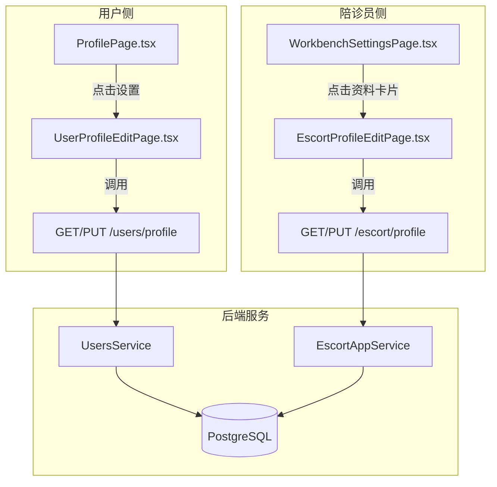

# 个人资料管理功能实现计划

## 一、数据库模型扩展

User 模型需新增字段以支持完整的个人资料：

```prisma
// server/prisma/schema.prisma
model User {
  // ...现有字段
  gender    String?   // male, female, unknown
  birthday  DateTime?
}
```

运行迁移：

```bash
npx prisma migrate dev --name add_user_profile_fields
```

## 二、后端 API 扩展

### 2.1 用户侧 API

**文件**: [server/src/modules/users/users.controller.ts](server/src/modules/users/users.controller.ts)

扩展现有 `PUT /users/profile` 接口，支持更多字段：

```typescript
@Put('profile')
async updateProfile(
  @CurrentUser('sub') userId: string,
  @Body() data: {
    nickname?: string
    avatar?: string
    gender?: string    // 新增
    birthday?: string  // 新增 (ISO格式)
  },
)
```

**文件**: [server/src/modules/users/users.service.ts](server/src/modules/users/users.service.ts)

更新 `updateProfile` 方法支持新字段。

### 2.2 陪诊员侧 API

**文件**: [server/src/modules/escort-app/escort-app.controller.ts](server/src/modules/escort-app/escort-app.controller.ts)

新增 `PUT /escort/profile` 接口：

```typescript
@Put('profile')
async updateProfile(
  @Request() req,
  @Body() data: {
    name?: string
    avatar?: string
    gender?: string
    introduction?: string
  },
)
```

## 三、前端预览器 API 层

**文件**: [src/components/terminal-preview/api.ts](src/components/terminal-preview/api.ts)

新增 API 方法：

- `getUserProfile()` - 获取用户资料
- `updateUserProfile(data)` - 更新用户资料
- `getEscortProfile()` - 获取陪诊员资料 (现有 escortRequest)
- `updateEscortProfile(data)` - 更新陪诊员资料

## 四、前端页面类型扩展

**文件**: [src/components/terminal-preview/types.ts](src/components/terminal-preview/types.ts)

新增页面类型：

```typescript
export type PreviewPage =
  // ...现有
  | 'user-profile-edit'    // 用户资料编辑
  | 'escort-profile-edit'  // 陪诊员资料编辑
```

## 五、新建页面组件

### 5.1 用户资料编辑页

**新文件**: `src/components/terminal-preview/components/pages/UserProfileEditPage.tsx`

功能：

- 头像上传（使用现有 upload 接口）
- 昵称编辑
- 手机号显示（仅展示，不可编辑）
- 性别选择（男/女/未设置）
- 生日选择（日期选择器）
- 保存按钮提交更新

### 5.2 陪诊员资料编辑页

**新文件**: `src/components/terminal-preview/components/pages/workbench/EscortProfileEditPage.tsx`

功能：

- 头像上传
- 姓名编辑
- 手机号显示（仅展示）
- 性别选择
- 个人简介编辑
- 保存按钮提交更新

## 六、现有页面改造

### 6.1 ProfilePage.tsx

**文件**: [src/components/terminal-preview/components/pages/ProfilePage.tsx](src/components/terminal-preview/components/pages/ProfilePage.tsx)

改造内容：

1. 接入 `getUserProfile()` API 获取真实数据
2. 设置按钮点击跳转到 `user-profile-edit` 页面
3. 用户头部区域显示真实头像/昵称/手机号

### 6.2 WorkbenchSettingsPage.tsx

**文件**: [src/components/terminal-preview/components/pages/workbench/WorkbenchSettingsPage.tsx](src/components/terminal-preview/components/pages/workbench/WorkbenchSettingsPage.tsx)

改造内容：

1. 个人资料卡片点击跳转到 `escort-profile-edit` 页面

## 七、主预览器路由注册

**文件**: [src/components/terminal-preview/index.tsx](src/components/terminal-preview/index.tsx)

新增页面路由 case：

```typescript
case 'user-profile-edit':
  return <UserProfileEditPage ... />
case 'escort-profile-edit':
  return <EscortProfileEditPage ... />
```

## 八、架构流程图

