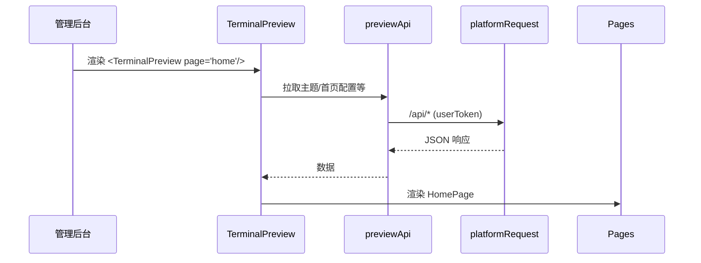
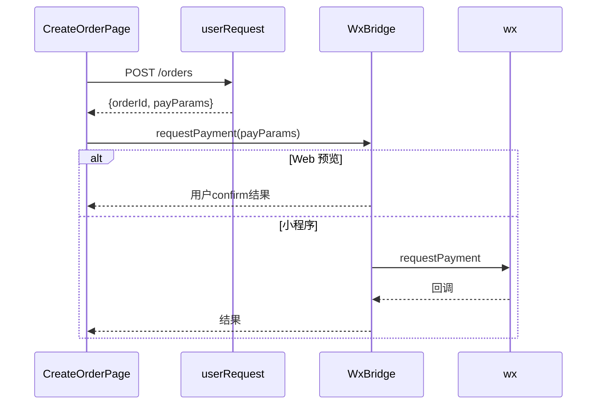
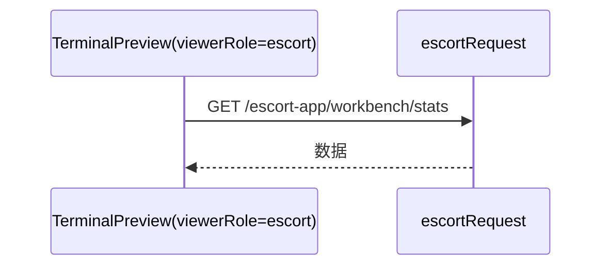

## 一、总体概览

* 路线：Web/H5 优先开发 + 小程序壳复用；UI/业务共享，宿主差异下沉到平台适配层与 WxBridge。

* 预览器用于在后台实时还原终端界面并调试，不代表真实终端逻辑。

## 二、技术架构

* 主组件与关键模块（含源码定位）：

  * 终端预览器入口：`src/components/terminal-preview/index.tsx:115`

  * 类型系统与页面枚举：`src/components/terminal-preview/types.ts:1`，有效页面列表 `VALID_PAGE_KEYS`：`types.ts:100`；页面元数据 `PAGE_METADATA`：`types.ts:177`

  * 平台适配统一入口：`src/components/terminal-preview/platform/index.ts:1`

  * 环境检测：`src/components/terminal-preview/platform/env.ts:19`（`isWxEnvironment`/`isBrowserEnvironment`/`isTaroEnvironment`）

  * WxBridge（Web 端 Mock 实现）：`src/components/terminal-preview/bridge/wx-bridge.ts:1`（支付模拟见 `:120`）

  * 跨宿主原语组件（默认指向 Web 实现）：`src/components/terminal-preview/ui/primitives/index.ts:17`

  * 调试面板（仅预览器显示）：`src/components/terminal-preview/components/DebugPanel.tsx:94`；显示规则 `shouldShowDebugPanel`: `:222-237`

  * 预览 API 封装与双通道规范：`src/components/terminal-preview/api.ts:1`；`ApiError`: `:181`；`ChannelMismatchError`: `:196`

* 组件关系图：

```mermaid
graph TD
  Admin[管理后台页面] --> TP[TerminalPreview 终端预览器\nindex.tsx]
  TP --> Pages[业务页面 components/pages/*]
  TP --> UI[跨宿主原语 ui/primitives]
  TP --> Hooks[useViewerRole/useScroll*]
  TP --> API[previewApi 预览数据封装]
  TP --> Platform[平台适配层 platform/]
  TP --> Bridge[WxBridge bridge/]
  TP --> Debug[DebugPanel]

  subgraph Web 预览环境
    UI --> WebUI[web.tsx HTML 实现]
    Bridge --> Mock[mockWxBridge]
    Platform --> BrowserReq[fetch/localStorage]
  end

  subgraph 小程序壳（独立/外部实现）
    MiniShell[小程序入口挂载 TP]
    UI --> MiniUI[miniapp.tsx Taro 组件实现]
    Bridge --> Real[realWxBridge (wx.* 实现)]
    Platform --> WxReq[wx.request / wx.setStorageSync]
  end
```

## 三、通信协议与数据交换

* 平台适配抽象（`platform/index.ts` 暴露）：

  * `platformRequest(url, { method, headers, data }) => { status, data }`

  * `platformStorage.getSync/setSync/removeSync/clearSync`

  * `isWxEnvironment/isBrowserEnvironment/isTaroEnvironment`

* 双通道请求（`api.ts` 约定）：

  * `userRequest`：用户通道（携带 `userToken`）

  * `escortRequest`：陪诊员通道（携带 `escortToken`）；`/escort-app/**` 只能走该通道

  * 以 `mock-` 开头的 token 禁止调用真实后端

  * 错误模型：`ApiError(status, message, endpoint)` 与 `ChannelMismatchError`

* WxBridge 能力与数据格式（以 Web 端 Mock 实现为准，真实实现由小程序壳提供）：

  * 登录：`login()/checkSession()`

  * 支付：`requestPayment(payParams)` → Web 端用 `confirm` 模拟（`wx-bridge.ts:120`）

  * 分享：`share(params)/getShareParams()`

  * 媒体：`chooseImage()/uploadFile()`（input\[file]/fetch+FormData 模拟）

## 四、关键接口调用流程

* 首页加载（Web 预览）：



* 创建订单+支付（预览模拟 vs 小程序真实）：



* 工作台（escort 通道）：



## 五、功能交互覆盖

* 已支持页面与能力：参考 `docs/终端预览器审计/全局终端预览器功能审计与迁移评估报告.md:119` 与 `types.ts:42`；覆盖 TabBar、营销中心、用户功能、陪诊员公开页、工作台、分销中心、CMS/帮助中心。

* 模拟不同宿主：

  * UI：通过 `ui/primitives` 在 Web 使用 HTML 实现，在小程序通过 alias 指向 Taro 组件实现。

  * 能力：Web 使用 `mockWxBridge`；小程序壳提供 `realWxBridge`（wx.\*）。

  * 视角：`useViewerRole` 推导，DebugPanel 仅用于预览器（`DebugPanel.tsx:222-237`）。

## 六、开发与调试

* DebugPanel：注入/清除 mock `escortToken`、手动 Revalidate、展示当前视角与 token（`components/DebugPanel.tsx:94`）。

* 入口校验：`validateInitialPage` 与 `VALID_PAGE_KEYS`/`PAGE_METADATA`（`types.ts:100`、`:177`）

* Mock 策略：`previewApi` 内置 Mock 降级路径，保障可预览性（`api.ts:46-78` 注释说明）

## 七、性能与包体

* 预览器：页面组件 lazy + Suspense 骨架（`index.tsx:63, 65` 注释说明），React Query 缓存，建议对大列表启用虚拟滚动与路由级代码拆分。

* 小程序：包体拆分（主包/分包）、静态资源走 CDN（`getFullResourceUrl`）、图片压缩/格式优化、按需加载。

## 八、典型场景交互流程图

* 管理后台配置实时预览、用户下单与支付、陪诊员工作台接单，详见报告正文中的 3 张 Mermaid 时序图。

## 九、预览报错 80051（source size 超 2MB）的处理指引（Mac）

* 问题：WeChat DevTools 预览/真机调试包体超 2MB 报错 `80051`，例如：`source size 3119KB exceed max limit 2MB`。

* 快速解法（仅影响本地预览/真机调试上限）：

  * 在微信开发者工具右上角【详情】→【本地设置】中勾选“预览及真机调试时主包、分包体积上限调整为 4M”。官方指引见微信开放社区文章（\[链接]<https://developers.weixin.qq.com/community/develop/article/doc/000e8418df02c89b94cdfbcfd51c13）。>

* 从根因上优化：

  * 资源管理：压缩大图片/字体，迁移到 CDN，运行时加载；

  * 分包：将工作台、分销中心、CMS 等低频页面放入分包，主包只保留首页与高频营销页；

  * 构建裁剪：排除 Mock/仅开发依赖、过滤无依赖文件；

  * 升级 DevTools 并清理缓存后重试。参考经验帖：\[1]\[4]\[5]（CSDN 经验型文章）。

## 十、落地建议

* 在仓库新增正式文档 `docs/终端预览器与小程序架构关系.md`，沉淀本报告图文；

* 若后续接入小程序壳：

  * 实现 `realWxBridge` 与平台 `request/storage` 适配；

  * 用统一的 RouteRegistry 生成小程序 `pages/subPackages` 配置；

  * 建立资源/CDN 策略与打包体积守护（CI 报警）。

