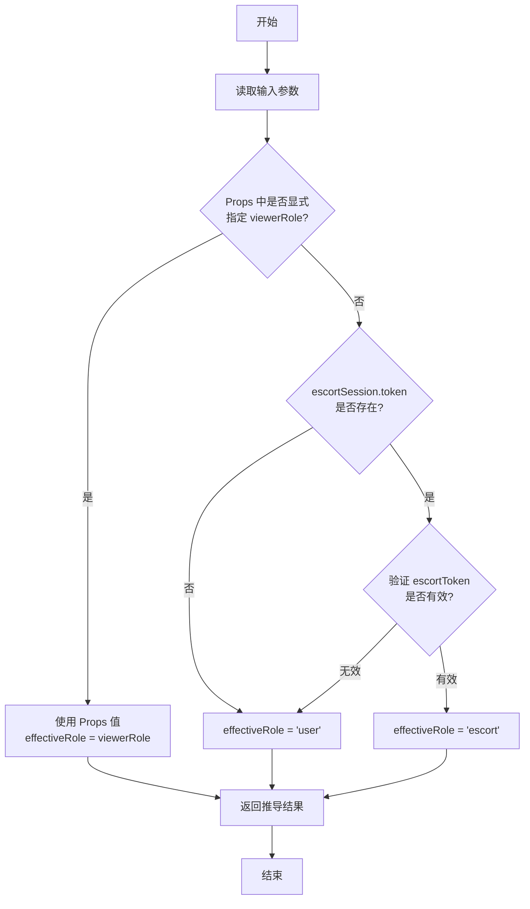
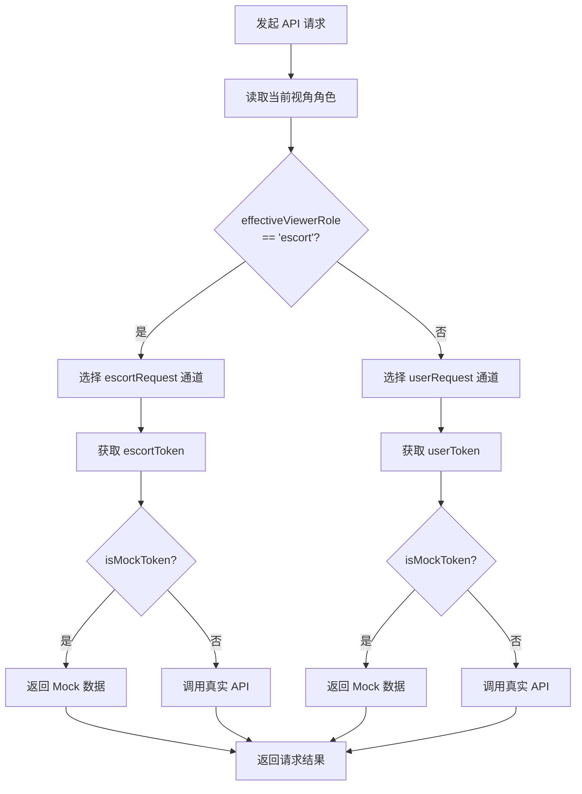
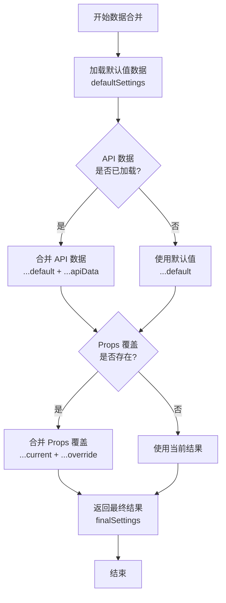

# 技术流程图

> **文档版本**: v1.0  
> **创建日期**: 2024-12-17  
> **说明**: 本文档包含专利申请所需的技术架构图和流程图

---

## 一、系统整体架构图

### 1.1 系统层次结构

```
┌─────────────────────────────────────────────────────────────────────────────┐
│                              用户交互层                                      │
│  ┌──────────────────────────────────────────────────────────────────────┐   │
│  │                         管理后台 Web 界面                              │   │
│  │  ┌─────────────────────────┐    ┌─────────────────────────────────┐  │   │
│  │  │      配置管理模块        │    │        终端预览器组件            │  │   │
│  │  │  • 首页配置             │    │  ┌─────────────────────────┐    │  │   │
│  │  │  • 服务管理             │◄──►│  │     DebugPanel         │    │  │   │
│  │  │  • 营销管理             │    │  │  视角 | Token | 通道    │    │  │   │
│  │  │  • 用户管理             │    │  ├─────────────────────────┤    │  │   │
│  │  │  • 陪诊员管理           │    │  │                         │    │  │   │
│  │  └─────────────────────────┘    │  │     PhoneFrame          │    │  │   │
│  │              │                   │  │    ┌───────────┐        │    │  │   │
│  │              │ Props             │  │    │  终端界面  │        │    │  │   │
│  │              │ 数据覆盖          │  │    │  渲染区域  │        │    │  │   │
│  │              ▼                   │  │    └───────────┘        │    │  │   │
│  │  ┌─────────────────────────┐    │  │    ┌───────────┐        │    │  │   │
│  │  │    数据覆盖层            │───►│  │    │  TabBar   │        │    │  │   │
│  │  │  themeSettings          │    │  │    └───────────┘        │    │  │   │
│  │  │  homeSettings           │    │  └─────────────────────────┘    │  │   │
│  │  │  marketingData          │    │                                 │  │   │
│  │  │  escortContext          │    │                                 │  │   │
│  │  └─────────────────────────┘    └─────────────────────────────────┘  │   │
│  └──────────────────────────────────────────────────────────────────────┘   │
└─────────────────────────────────────────────────────────────────────────────┘
                                      │
                                      ▼
┌─────────────────────────────────────────────────────────────────────────────┐
│                              业务逻辑层                                      │
│  ┌──────────────────────────────────────────────────────────────────────┐   │
│  │                         双通道会话架构                                 │   │
│  │  ┌─────────────────────────┐    ┌─────────────────────────────────┐  │   │
│  │  │     userRequest         │    │       escortRequest             │  │   │
│  │  │     用户请求通道         │    │       服务者请求通道             │  │   │
│  │  │  ┌─────────────────┐    │    │  ┌─────────────────────────┐    │  │   │
│  │  │  │ Authorization:  │    │    │  │ Authorization:          │    │  │   │
│  │  │  │ Bearer userToken│    │    │  │ Bearer escortToken      │    │  │   │
│  │  │  └─────────────────┘    │    │  └─────────────────────────┘    │  │   │
│  │  └───────────┬─────────────┘    └───────────────┬─────────────────┘  │   │
│  │              │                                   │                    │   │
│  │              └─────────────┬─────────────────────┘                    │   │
│  │                            │                                          │   │
│  │              ┌─────────────▼─────────────┐                            │   │
│  │              │     Mock Token 检测器      │                            │   │
│  │              │  isMockToken(token) ?      │                            │   │
│  │              │    → 返回 Mock 数据        │                            │   │
│  │              │    → 调用真实 API          │                            │   │
│  │              └───────────────────────────┘                            │   │
│  └──────────────────────────────────────────────────────────────────────┘   │
└─────────────────────────────────────────────────────────────────────────────┘
                                      │
                                      ▼
┌─────────────────────────────────────────────────────────────────────────────┐
│                              数据服务层                                      │
│  ┌──────────────────────────────────────────────────────────────────────┐   │
│  │                           后端 API 服务                               │   │
│  │  ┌───────────────────┐  ┌───────────────────┐  ┌─────────────────┐   │   │
│  │  │  /api/user/*      │  │ /api/escort-app/* │  │  /api/admin/*   │   │   │
│  │  │  用户接口          │  │  服务者接口        │  │  管理接口       │   │   │
│  │  │  • 服务列表        │  │  • 工作台         │  │  • 配置管理     │   │   │
│  │  │  • 订单管理        │  │  • 订单池         │  │  • 数据统计     │   │   │
│  │  │  • 会员信息        │  │  • 收入明细       │  │  • 用户管理     │   │   │
│  │  └───────────────────┘  └───────────────────┘  └─────────────────┘   │   │
│  └──────────────────────────────────────────────────────────────────────┘   │
│  ┌──────────────────────────────────────────────────────────────────────┐   │
│  │                           数据库层                                    │   │
│  │  ┌───────────────────┐  ┌───────────────────┐  ┌─────────────────┐   │   │
│  │  │  用户数据          │  │  服务数据          │  │  配置数据       │   │   │
│  │  └───────────────────┘  └───────────────────┘  └─────────────────┘   │   │
│  └──────────────────────────────────────────────────────────────────────┘   │
└─────────────────────────────────────────────────────────────────────────────┘
```

---

## 二、核心流程图

### 2.1 视角推导流程图

```
                    ┌─────────────────┐
                    │     开始        │
                    └────────┬────────┘
                             │
                             ▼
                    ┌─────────────────┐
                    │  读取输入参数    │
                    │  • viewerRole   │
                    │  • userSession  │
                    │  • escortSession│
                    └────────┬────────┘
                             │
                             ▼
                  ┌──────────────────────┐
                  │ Props 中是否显式指定  │
                  │   viewerRole ?       │
                  └──────────┬───────────┘
                             │
              ┌──────────────┴──────────────┐
              │ 是                          │ 否
              ▼                             ▼
    ┌─────────────────┐          ┌──────────────────────┐
    │ 使用 Props 值    │          │ escortSession.token  │
    │ effectiveRole   │          │     是否存在?        │
    │   = viewerRole  │          └──────────┬───────────┘
    └────────┬────────┘                     │
             │                  ┌───────────┴───────────┐
             │                  │ 是                    │ 否
             │                  ▼                       ▼
             │       ┌─────────────────┐     ┌─────────────────┐
             │       │ 验证 escortToken│     │ effectiveRole   │
             │       │   是否有效?     │     │   = 'user'      │
             │       └────────┬────────┘     └────────┬────────┘
             │                │                       │
             │      ┌─────────┴─────────┐             │
             │      │ 有效              │ 无效        │
             │      ▼                   ▼             │
             │  ┌────────────┐  ┌────────────┐        │
             │  │ effective  │  │ effective  │        │
             │  │ Role =     │  │ Role =     │        │
             │  │ 'escort'   │  │ 'user'     │        │
             │  └─────┬──────┘  └─────┬──────┘        │
             │        │               │               │
             └────────┴───────────────┴───────────────┘
                             │
                             ▼
                    ┌─────────────────┐
                    │  返回推导结果    │
                    │ effectiveRole   │
                    └────────┬────────┘
                             │
                             ▼
                    ┌─────────────────┐
                    │      结束       │
                    └─────────────────┘
```

### 2.2 请求通道选择流程图

```
                    ┌─────────────────┐
                    │  发起 API 请求   │
                    └────────┬────────┘
                             │
                             ▼
                  ┌──────────────────────┐
                  │   读取当前视角角色    │
                  │   effectiveViewerRole │
                  └──────────┬───────────┘
                             │
                             ▼
                  ┌──────────────────────┐
                  │ effectiveViewerRole  │
                  │    === 'escort' ?    │
                  └──────────┬───────────┘
                             │
              ┌──────────────┴──────────────┐
              │ 是                          │ 否
              ▼                             ▼
    ┌─────────────────┐          ┌─────────────────┐
    │ 选择通道:        │          │ 选择通道:        │
    │ escortRequest   │          │ userRequest     │
    └────────┬────────┘          └────────┬────────┘
             │                            │
             ▼                            ▼
    ┌─────────────────┐          ┌─────────────────┐
    │ 获取 escortToken│          │ 获取 userToken  │
    └────────┬────────┘          └────────┬────────┘
             │                            │
             ▼                            ▼
    ┌─────────────────┐          ┌─────────────────┐
    │ isMockToken     │          │ isMockToken     │
    │ (escortToken)?  │          │ (userToken)?    │
    └────────┬────────┘          └────────┬────────┘
             │                            │
       ┌─────┴─────┐                ┌─────┴─────┐
       │ 是        │ 否             │ 是        │ 否
       ▼           ▼                ▼           ▼
┌───────────┐ ┌───────────┐  ┌───────────┐ ┌───────────┐
│ 返回 Mock │ │ 调用真实  │  │ 返回 Mock │ │ 调用真实  │
│ 数据      │ │ API       │  │ 数据      │ │ API       │
└─────┬─────┘ └─────┬─────┘  └─────┬─────┘ └─────┬─────┘
      │             │              │             │
      └──────┬──────┘              └──────┬──────┘
             │                            │
             └────────────┬───────────────┘
                          │
                          ▼
                 ┌─────────────────┐
                 │   返回请求结果   │
                 └─────────────────┘
```

### 2.3 数据覆盖合并流程图

```
                    ┌─────────────────┐
                    │  开始数据合并    │
                    └────────┬────────┘
                             │
                             ▼
                  ┌──────────────────────┐
                  │   加载默认值数据      │
                  │   defaultSettings    │
                  └──────────┬───────────┘
                             │
                             ▼
                  ┌──────────────────────┐
                  │  API 数据是否已加载?  │
                  └──────────┬───────────┘
                             │
              ┌──────────────┴──────────────┐
              │ 是                          │ 否
              ▼                             ▼
    ┌─────────────────┐          ┌─────────────────┐
    │ 合并 API 数据    │          │ 使用默认值      │
    │ { ...default,   │          │ { ...default }  │
    │   ...apiData }  │          └────────┬────────┘
    └────────┬────────┘                   │
             │                            │
             └────────────┬───────────────┘
                          │
                          ▼
                  ┌──────────────────────┐
                  │  Props 覆盖是否存在?  │
                  └──────────┬───────────┘
                             │
              ┌──────────────┴──────────────┐
              │ 是                          │ 否
              ▼                             ▼
    ┌─────────────────┐          ┌─────────────────┐
    │ 合并 Props 覆盖  │          │ 使用当前结果    │
    │ { ...current,   │          └────────┬────────┘
    │   ...override } │                   │
    └────────┬────────┘                   │
             │                            │
             └────────────┬───────────────┘
                          │
                          ▼
                 ┌─────────────────┐
                 │  返回最终结果    │
                 │  finalSettings  │
                 └────────┬────────┘
                          │
                          ▼
                 ┌─────────────────┐
                 │     结束        │
                 └─────────────────┘
```

---

## 三、页面路由状态机

### 3.1 预览器页面导航状态图

```
                           ┌─────────────────────────────────────┐
                           │            初始化                   │
                           │    page = initialPage (默认 home)   │
                           └──────────────┬──────────────────────┘
                                          │
                                          ▼
    ┌─────────────────────────────────────────────────────────────────────────┐
    │                              TabBar 页面                                 │
    │                                                                         │
    │   ┌─────────┐      ┌─────────┐      ┌─────────┐      ┌─────────┐       │
    │   │  home   │◄────►│services │◄────►│  cases  │◄────►│ profile │       │
    │   │  首页   │      │ 服务    │      │  病历   │      │  我的   │       │
    │   └────┬────┘      └────┬────┘      └─────────┘      └────┬────┘       │
    │        │                │                                  │            │
    └────────┼────────────────┼──────────────────────────────────┼────────────┘
             │                │                                  │
             │                │                                  │
             ▼                ▼                                  ▼
    ┌─────────────────────────────────────────────────────────────────────────┐
    │                            子页面（用户视角）                            │
    │                                                                         │
    │   ┌───────────────────────────────────────────────────────────────┐     │
    │   │                    服务相关                                    │     │
    │   │   services ──► service-detail ──► create-order               │     │
    │   │                                                               │     │
    │   └───────────────────────────────────────────────────────────────┘     │
    │                                                                         │
    │   ┌───────────────────────────────────────────────────────────────┐     │
    │   │                    营销中心                                    │     │
    │   │   membership ──► membership-plans                             │     │
    │   │   coupons ──► coupons-available                               │     │
    │   │   points ──► points-records                                   │     │
    │   │   campaigns ──► campaigns-detail                              │     │
    │   │   referrals                                                   │     │
    │   └───────────────────────────────────────────────────────────────┘     │
    │                                                                         │
    │   ┌───────────────────────────────────────────────────────────────┐     │
    │   │                    用户订单                                    │     │
    │   │   user-orders ──► user-order-detail                           │     │
    │   │   patients ──► patient-edit                                   │     │
    │   └───────────────────────────────────────────────────────────────┘     │
    │                                                                         │
    └─────────────────────────────────────────────────────────────────────────┘
                                          │
                                          │ 视角切换
                                          ▼
    ┌─────────────────────────────────────────────────────────────────────────┐
    │                          子页面（服务者视角）                            │
    │                                                                         │
    │   ┌───────────────────────────────────────────────────────────────┐     │
    │   │                      工作台                                    │     │
    │   │                                                               │     │
    │   │   workbench ──┬──► workbench-orders-pool ──► workbench-order-detail│
    │   │               │                                               │     │
    │   │               ├──► workbench-earnings ──► workbench-withdraw  │     │
    │   │               │                                               │     │
    │   │               ├──► workbench-settings                         │     │
    │   │               │                                               │     │
    │   │               ├──► workbench-service-types                    │     │
    │   │               │                                               │     │
    │   │               └──► my-orders                                  │     │
    │   └───────────────────────────────────────────────────────────────┘     │
    │                                                                         │
    │   ┌───────────────────────────────────────────────────────────────┐     │
    │   │                     分销中心                                   │     │
    │   │                                                               │     │
    │   │   distribution ──┬──► distribution-members                    │     │
    │   │                  │                                            │     │
    │   │                  ├──► distribution-records                    │     │
    │   │                  │                                            │     │
    │   │                  ├──► distribution-invite                     │     │
    │   │                  │                                            │     │
    │   │                  └──► distribution-promotion                  │     │
    │   └───────────────────────────────────────────────────────────────┘     │
    │                                                                         │
    └─────────────────────────────────────────────────────────────────────────┘
```

---

## 四、组件交互序列图

### 4.1 配置实时预览序列图

```
┌────────┐     ┌─────────────┐     ┌──────────────┐     ┌───────────┐
│ 管理员  │     │ 配置编辑器   │     │ 终端预览器    │     │ API 服务  │
└───┬────┘     └──────┬──────┘     └──────┬───────┘     └─────┬─────┘
    │                 │                   │                   │
    │  修改配置       │                   │                   │
    │────────────────►│                   │                   │
    │                 │                   │                   │
    │                 │  触发 onChange    │                   │
    │                 │  更新 Props       │                   │
    │                 │──────────────────►│                   │
    │                 │                   │                   │
    │                 │                   │  合并数据         │
    │                 │                   │  (Props > API)    │
    │                 │                   │─────────┐         │
    │                 │                   │         │         │
    │                 │                   │◄────────┘         │
    │                 │                   │                   │
    │                 │                   │  重新渲染界面      │
    │                 │                   │─────────┐         │
    │                 │                   │         │         │
    │                 │                   │◄────────┘         │
    │                 │                   │                   │
    │  看到实时预览   │                   │                   │
    │◄────────────────────────────────────│                   │
    │                 │                   │                   │
    │  点击保存       │                   │                   │
    │────────────────►│                   │                   │
    │                 │                   │                   │
    │                 │  调用保存 API     │                   │
    │                 │───────────────────────────────────────►
    │                 │                   │                   │
    │                 │  返回成功         │                   │
    │                 │◄───────────────────────────────────────
    │                 │                   │                   │
    │  保存成功提示   │                   │                   │
    │◄────────────────│                   │                   │
    │                 │                   │                   │
```

### 4.2 视角切换序列图

```
┌────────┐     ┌───────────┐     ┌──────────────┐     ┌─────────────┐
│ 管理员  │     │DebugPanel │     │ 预览器主组件  │     │useViewerRole│
└───┬────┘     └─────┬─────┘     └──────┬───────┘     └──────┬──────┘
    │                │                   │                    │
    │  点击切换到    │                   │                    │
    │  陪诊员视角    │                   │                    │
    │───────────────►│                   │                    │
    │                │                   │                    │
    │                │  注入 escortToken │                    │
    │                │  (mock-token)     │                    │
    │                │──────────────────►│                    │
    │                │                   │                    │
    │                │                   │  触发视角推导      │
    │                │                   │───────────────────►│
    │                │                   │                    │
    │                │                   │    检测 Token      │
    │                │                   │    推导视角        │
    │                │                   │◄───────────────────│
    │                │                   │    return 'escort' │
    │                │                   │                    │
    │                │                   │  更新视角状态      │
    │                │                   │─────────┐          │
    │                │                   │         │          │
    │                │                   │◄────────┘          │
    │                │                   │                    │
    │                │                   │  切换到工作台页面   │
    │                │                   │  使用 escortRequest│
    │                │                   │─────────┐          │
    │                │                   │         │          │
    │                │                   │◄────────┘          │
    │                │                   │                    │
    │  看到工作台    │                   │                    │
    │  界面          │                   │                    │
    │◄──────────────────────────────────│                    │
    │                │                   │                    │
```

---

## 五、数据流图

### 5.1 完整数据流图

```
┌─────────────────────────────────────────────────────────────────────────────┐
│                               数据流向图                                     │
└─────────────────────────────────────────────────────────────────────────────┘

                    ┌───────────────────────────────────────┐
                    │           外部数据源                   │
                    │  ┌─────────────┐  ┌─────────────────┐ │
                    │  │  后端 API   │  │  本地存储       │ │
                    │  │  (真实数据)  │  │  (Token/配置)   │ │
                    │  └──────┬──────┘  └────────┬────────┘ │
                    └─────────┼──────────────────┼──────────┘
                              │                  │
                              ▼                  ▼
    ┌─────────────────────────────────────────────────────────────────────────┐
    │                         数据获取层                                       │
    │                                                                         │
    │   ┌───────────────────────────────────────────────────────────────┐     │
    │   │                      React Query                              │     │
    │   │   useQuery('themeSettings')  useQuery('homeSettings')         │     │
    │   │   useQuery('banners')        useQuery('services')             │     │
    │   └───────────────────────────────────────────────────────────────┘     │
    │                                    │                                    │
    │                                    ▼                                    │
    │   ┌───────────────────────────────────────────────────────────────┐     │
    │   │                    fetchedData                                │     │
    │   │   fetchedThemeSettings  fetchedHomeSettings  fetchedBanners   │     │
    │   └───────────────────────────────────────────────────────────────┘     │
    │                                                                         │
    └─────────────────────────────────────────────────────────────────────────┘
                              │
                              ▼
    ┌─────────────────────────────────────────────────────────────────────────┐
    │                         数据合并层                                       │
    │                                                                         │
    │   ┌─────────────────┐  ┌─────────────────┐  ┌─────────────────┐         │
    │   │   默认值        │  │   API 数据      │  │   Props 覆盖    │         │
    │   │  defaultXxx     │  │  fetchedXxx     │  │  xxxOverride    │         │
    │   │  (优先级: 3)    │  │  (优先级: 2)    │  │  (优先级: 1)    │         │
    │   └────────┬────────┘  └────────┬────────┘  └────────┬────────┘         │
    │            │                    │                    │                  │
    │            └────────────────────┴────────────────────┘                  │
    │                                 │                                       │
    │                                 ▼                                       │
    │            ┌─────────────────────────────────────────┐                  │
    │            │            useMemo 合并                  │                  │
    │            │  { ...default, ...fetched, ...override } │                  │
    │            └─────────────────────────────────────────┘                  │
    │                                 │                                       │
    └─────────────────────────────────┼───────────────────────────────────────┘
                                      │
                                      ▼
    ┌─────────────────────────────────────────────────────────────────────────┐
    │                         视图渲染层                                       │
    │                                                                         │
    │   ┌───────────────────────────────────────────────────────────────┐     │
    │   │                    finalData                                  │     │
    │   │   themeSettings  homeSettings  bannerData  statsData          │     │
    │   └──────────────────────────┬────────────────────────────────────┘     │
    │                              │                                          │
    │                              ▼                                          │
    │   ┌───────────────────────────────────────────────────────────────┐     │
    │   │                    UI 组件                                    │     │
    │   │   BrandSection  BannerSection  StatsCard  CategorySection     │     │
    │   │   ServiceRecommendation  FooterSection  TabBarNav             │     │
    │   └───────────────────────────────────────────────────────────────┘     │
    │                                                                         │
    └─────────────────────────────────────────────────────────────────────────┘
```

---

## 六、Mermaid 版本流程图

> 以下是 Mermaid 格式的流程图，可直接在支持 Mermaid 的文档中渲染

### 6.1 视角推导流程 (Mermaid)



### 6.2 双通道请求流程 (Mermaid)



### 6.3 数据合并流程 (Mermaid)



---

## 七、图例说明

| 符号 | 含义 |
|------|------|
| `───►` | 数据流向 |
| `◄───►` | 双向交互 |
| `┌─┐` `└─┘` | 组件/模块边界 |
| `│ │` | 层次包含关系 |
| `◄────┘` | 自循环/内部处理 |
| 虚线框 | 可选组件 |
| 实线框 | 必要组件 |

---

## 八、图表使用说明

1. **架构图**：用于说明系统整体结构和模块关系
2. **流程图**：用于说明具体技术方案的执行步骤
3. **序列图**：用于说明组件间的交互时序
4. **数据流图**：用于说明数据的流转过程
5. **状态机图**：用于说明页面路由的状态转换

专利申请时，建议将 ASCII 图转换为正式的矢量图（如使用 draw.io、Visio 等工具）。
