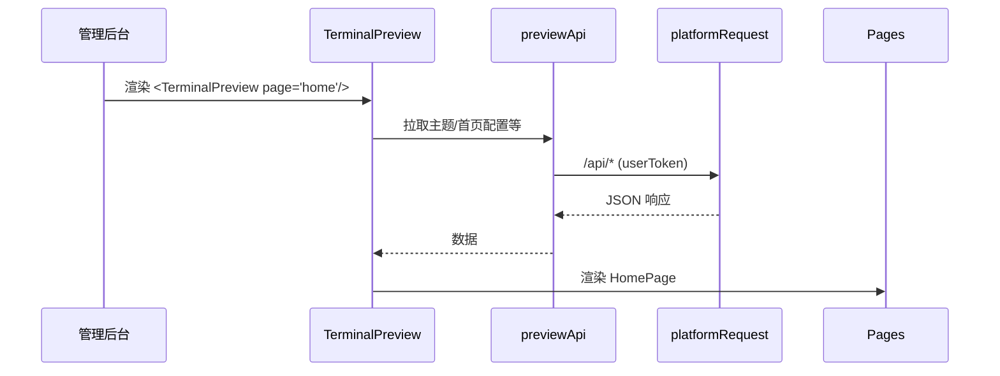
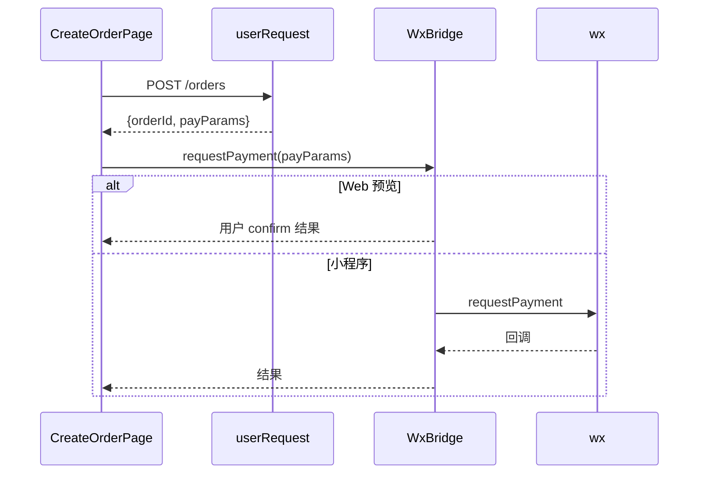
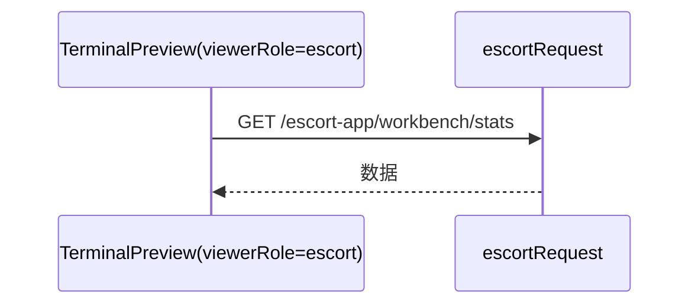

# 终端预览器与小程序的架构关系与交互机制（含 80051 问题指引）
>
> 文档版本：v1.0  ·  更新日期：2025-12-18  ·  适用平台：Mac 开发环境
>
> 目标：面向研发、测试与产品，完整说明本项目中“终端预览器（Web/H5 内嵌）”与“小程序”的架构关系、通信机制、功能覆盖、调试与性能策略，并提供典型交互流程图与 80051 预览报错的解决方案。

---

## 1. 总体概览
- 路线：Web/H5 优先开发 + 小程序壳复用；UI/业务共享，宿主差异下沉到平台适配层与 WxBridge。
- 预览器用于在后台实时还原终端界面并调试，不代表真实终端逻辑（真实终端的视角由 token 校验推导）。
- 关键源码定位：
  - 终端预览器入口：`src/components/terminal-preview/index.tsx:115`
  - 类型系统与页面枚举：`src/components/terminal-preview/types.ts:1`，有效页面列表 `VALID_PAGE_KEYS`：`types.ts:100`；页面元数据 `PAGE_METADATA`：`types.ts:177`
  - 平台适配统一入口：`src/components/terminal-preview/platform/index.ts:1`
  - 环境检测：`src/components/terminal-preview/platform/env.ts:19`
  - WxBridge（Web 端 Mock 实现）：`src/components/terminal-preview/bridge/wx-bridge.ts:1`（支付模拟见 `:120`）
  - 跨宿主原语组件（默认指向 Web 实现）：`src/components/terminal-preview/ui/primitives/index.ts:17`
  - 调试面板（仅预览器显示）：`src/components/terminal-preview/components/DebugPanel.tsx:94`；显示规则：`shouldShowDebugPanel`: `:222-237`
  - 预览 API 封装与双通道规范：`src/components/terminal-preview/api.ts:1`；`ApiError`: `:181`；`ChannelMismatchError`: `:196`

---

## 2. 技术架构
### 2.1 组件关系图
```mermaid
graph TD
  Admin[管理后台页面] --\u003e TP[TerminalPreview 终端预览器\nindex.tsx]
  TP --\u003e Pages[业务页面 components/pages/*]
  TP --\u003e UI[跨宿主原语 ui/primitives]
  TP --\u003e Hooks[useViewerRole/useScroll*]
  TP --\u003e API[previewApi 预览数据封装]
  TP --\u003e Platform[平台适配层 platform/]
  TP --\u003e Bridge[WxBridge bridge/]
  TP --\u003e Debug[DebugPanel]

  subgraph Web 预览环境
    UI --\u003e WebUI[web.tsx HTML 实现]
    Bridge --\u003e Mock[mockWxBridge]
    Platform --\u003e BrowserReq[fetch/localStorage]
  end

  subgraph 小程序壳（独立/外部实现）
    MiniShell[小程序入口挂载 TP]
    UI --\u003e MiniUI[miniapp.tsx Taro 组件实现]
    Bridge --\u003e Real[realWxBridge (wx.* 实现)]
    Platform --\u003e WxReq[wx.request / wx.setStorageSync]
  end
```

### 2.2 通信协议与数据交换格式
- 平台适配抽象（`platform/index.ts` 暴露）：
  - `platformRequest(url, { method, headers, data }) => { status, data }`
  - `platformStorage.getSync/setSync/removeSync/clearSync`
  - `isWxEnvironment/isBrowserEnvironment/isTaroEnvironment`
- 双通道请求（`api.ts` 约定）：
  - `userRequest`：用户通道（携带 `userToken`）
  - `escortRequest`：陪诊员通道（携带 `escortToken`）；`/escort-app/**` 只能走该通道
  - 以 `mock-` 开头的 token 禁止调用真实后端
  - 错误模型：`ApiError(status, message, endpoint)` 与 `ChannelMismatchError`
- WxBridge 能力与数据格式（以 Web 端 Mock 实现为准，真实实现由小程序壳提供）：
  - 登录：`login()/checkSession()`
  - 支付：`requestPayment(payParams)` → Web 端用 `confirm` 模拟（`wx-bridge.ts:120`）
  - 分享：`share(params)/getShareParams()`
  - 媒体：`chooseImage()/uploadFile()`（`input[type=file]` + `fetch/FormData` 模拟）

---

## 3. 接口文档（精选）
> 注：以下为预览器规范层接口，真实后端接口以网关文档为准。

### 3.1 请求 Envelope（逻辑形态）
```ts
interface RequestEnvelope<P = any> {
  channel: 'user' | 'escort'
  token: string | null
  endpoint: string
  payload?: P
}

interface ApiSuccessResponse<T = any> { code: 0; message: string; data: T }
interface ApiErrorResponse { code: number; message: string }
```

### 3.2 示例端点
- 用户下单：`POST /api/orders`
  - 请求：`{ serviceId: string, patientId: string, scheduleAt: string, couponId?: string }`
  - 响应：`{ orderId: string, payParams?: WxPayParams }`
- 用户订单详情：`GET /api/orders/:id`
- 陪诊员订单池：`GET /api/escort-app/orders/pool`
- 工作台统计：`GET /api/escort-app/workbench/stats`

### 3.3 WxBridge 典型数据
- 支付参数：
```json
{ "timeStamp":"1700000000", "nonceStr":"random", "package":"prepay_id=xxx", "signType":"MD5", "paySign":"xxxx" }
```
- 分享参数：
```json
{ "title":"陪诊服务", "desc":"一站式医院陪诊服务", "path":"/pages/escort/detail?id=123", "imageUrl":"https://cdn.example.com/share.png" }
```

---

## 4. 关键调用流程
### 4.1 首页加载（Web 预览）


### 4.2 创建订单 + 支付（预览模拟 vs 小程序真实）


### 4.3 工作台（escort 通道）


---

## 5. 功能交互覆盖
- 已支持页面与能力（来源：`docs/终端预览器审计/全局终端预览器功能审计与迁移评估报告.md:119` 与 `types.ts:42`）：
  - TabBar 基础页、营销中心、用户功能、陪诊员公开页、工作台、分销中心、CMS/帮助中心
- 模拟不同宿主：
  - UI：通过 `ui/primitives` 在 Web 使用 HTML 实现，在小程序通过 alias 指向 Taro 组件实现。
  - 能力：Web 使用 `mockWxBridge`；小程序壳提供 `realWxBridge`（wx.*）。
  - 视角：`useViewerRole` 推导，DebugPanel 仅用于预览器（`DebugPanel.tsx:222-237`）。

---

## 6. 开发与调试
- DebugPanel：注入/清除 mock `escortToken`、手动 Revalidate、展示当前视角与 token（`components/DebugPanel.tsx:94`）。
- 入口校验：`validateInitialPage` 与 `VALID_PAGE_KEYS`/`PAGE_METADATA`（`types.ts:100`、`:177`）。
- Mock 策略：`previewApi` 内置 Mock 降级路径，保障可预览性（`api.ts:46-78` 注释）。

---

## 7. 性能与包体
### 7.1 预览器（Web）
- 页面组件 lazy + Suspense 骨架（见 `index.tsx:63, 65` 注释说明）。
- React Query 缓存；建议：路由级代码拆分、大列表虚拟滚动、首页数据预拉取。

### 7.2 小程序
- 分包：工作台/分销中心/CMS 等低频页面放入分包；主包只保留首页与高频页面。
- 资源：静态资源上 CDN（`getFullResourceUrl`），图片压缩/格式优化（WebP/AVIF）。
- 构建剔除：排除 Mock 与仅开发依赖，过滤无依赖文件。

---

## 8. 常见问题排查
- 页面白屏/打不开：检查 `page` 是否在 `VALID_PAGE_KEYS`；查看控制台“入口不允许”的校验错误。
- 工作台请求走错通道：若触发 `ChannelMismatchError`，检查是否用 `userRequest` 调了 `/escort-app/**`。
- 视角与 token 不一致：查看 DebugPanel 的 `effectiveViewerRole` 与 token；清除 `escortToken` 并 Revalidate。
- 真机与预览不一致：排查是否依赖 Mock 的 WxBridge 行为；核对小程序环境 `getApiBaseUrl()` 指向。
- 资源加载慢：区分后端响应慢 vs 前端渲染瓶颈；避免一次性加载过多图片/列表项。

---

## 9. 预览报错 80051（source size 超 2MB）解决指引（Mac）
- 现象：WeChat DevTools 预览/真机调试报错 `80051`，如 `source size 3119KB exceed max limit 2MB`。
- 快速解法（仅影响本地预览/真机调试上限）：
  1) 打开微信开发者工具 → 右上角【详情】 →【本地设置】。
  2) 勾选“预览及真机调试时主包、分包体积上限调整为 4M”。
  3) 再次预览即可（如未生效可重启工具）。
  - 官方参考：微信开放社区文章（预览及真机调试时包超过 2M 的解决）：
    - https://developers.weixin.qq.com/community/develop/article/doc/000e8418df02c89b94cdfbcfd51c13
- 根因优化（建议尽快实施）：
  - 资源管理：压缩大图片/字体，迁移到 CDN，运行时加载。
  - 分包：将工作台、分销中心、CMS 等低频页面放入分包。
  - 构建裁剪：剔除 Mock/仅开发依赖、过滤无依赖文件、清理缓存后重试。
  - 经验帖参考（CSDN 经验型文章）：
    - https://blog.csdn.net/weixin_44852765/article/details/112280631
    - https://blog.csdn.net/m0_64196951/article/details/145079201

---

## 10. 后续落地建议
- 在小程序壳实现/接入：
  - 实现 `realWxBridge` 与平台 `request/storage` 适配，统一由 `platform/index.ts` 输出。
  - 使用统一的 RouteRegistry 生成小程序 `pages/subPackages` 配置。
  - 建立资源/CDN 策略与打包体积守护（CI 报警）。
- 文档维护：当页面/通道/桥接协议有变更时，同步更新本文件与 `docs/终端预览器集成/*` 系列文档。

---

（完）
