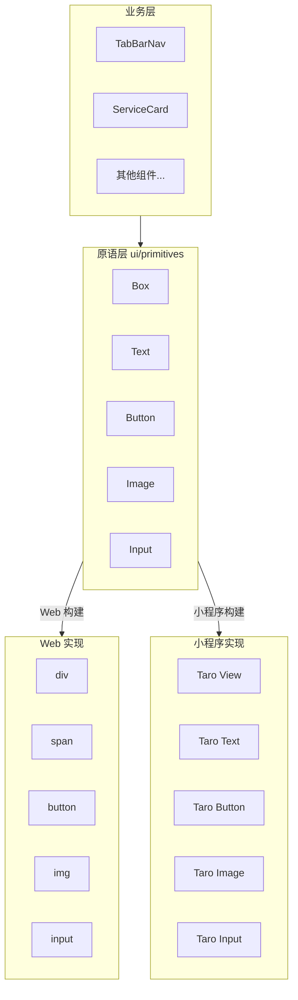

# 小程序组件适配改造计划

> 创建日期：2024-12-18  
> 最后更新：2025-12-18（小程序构建/渲染器 P0 已修复，React Query Context 阻塞定位中）  
> 问题等级：P0 阻塞项  
> 状态：阶段 1 基础架构已完成 ✅；阶段 2 进行中（存在 P0 运行阻塞）

---

## 一、问题调查结果

### 1.1 当前状态

小程序宿主壳工程显示的是**占位界面**，无法加载真正的终端预览器组件：

```
miniapp-shell/src/runtime/terminal-preview-app.tsx  ← 当前使用（占位组件）
src/components/terminal-preview/index.tsx           ← 目标加载（真正的终端预览器）
```

### 1.2 根本原因

**终端预览器使用 HTML 元素，小程序只支持 Taro 组件**：

| Web 元素 | 小程序对应 | 说明 |
|---------|-----------|------|
| `<div>` | `<View>` | 容器 |
| `<span>` | `<Text>` | 文本 |
| `<button>` | `<Button>` | 按钮 |
| `` | `<Image>` | 图片 |
| `<input>` | `<Input>` | 输入框 |
| `<nav>` | `<View>` | 导航 |

**代码示例对比**：

```tsx
// Web 版（当前）
<div className="flex items-center">
  <button onClick={handleClick}>
    <span>点击</span>
  </button>
</div>

// 小程序版（需要）
<View className="flex items-center">
  <Button onClick={handleClick}>
    <Text>点击</Text>
  </Button>
</View>
```

### 1.3 依赖问题分析

| 依赖 | 小程序兼容性 | 影响范围 |
|-----|-------------|---------|
| `lucide-react` | ❌ 依赖 SVG | 所有图标 |
| `@/components/ui/safe-html` | ❌ 依赖 DOM | 2 个文件 |
| `tailwindcss` | ⚠️ 需配置 | 全局样式 |
| `@tanstack/react-query` | ⚠️ 运行阻塞（Context 丢失） | 全局数据请求（useQuery/useQueryClient） |
| `clsx` / `tailwind-merge` | ✅ 兼容 | cn 函数 |

**使用 DOM API 的文件**（8 个）：
- `EscortLoginDialog.tsx` - `document.getElementById`
- `DebugPanel.tsx` - `navigator.clipboard`
- `PermissionPrompt.tsx` - `window.open`
- `UserProfileEditPage.tsx` - `document.createElement`
- `EscortProfileEditPage.tsx` - `document.createElement`
- `CampaignsPage.tsx` - `navigator.share`
- `DistributionInvitePage.tsx` - `navigator.clipboard`
- `OrderComplaintPage.tsx` - `window.alert`

---

## 二、改造方案

### 方案选型

| 方案 | 工作量 | 风险 | 推荐度 |
|-----|-------|------|-------|
| A. 完全重写（Taro 组件） | 高（2-3周） | 低 | ⭐⭐ |
| B. 条件编译（Web/小程序双版本） | 高（2-3周） | 中 | ⭐⭐ |
| **C. 渐进式适配（推荐）** | 中（1-2周） | 低 | ⭐⭐⭐⭐⭐ |

**选择方案 C：渐进式适配**

原因：
1. 符合"不重写业务逻辑"原则
2. 可立即验证核心链路
3. 风险可控，可随时回退

### 方案 C 详细设计

```
阶段 1：跨宿主原语组件（基础架构）✅ 已完成
├── 创建 ui/primitives 目录结构
├── 实现 Web 版原语组件（HTML 元素）
├── 实现小程序版原语组件（Taro 组件）
├── 配置 miniapp-shell alias 指向小程序实现
└── 演示替换：TabBarNav 组件

阶段 2：核心组件替换（进行中）
├── 首页组件（BannerSection, CategorySection 等）
├── 服务相关页面
├── 订单相关页面
└── 个人中心页面

阶段 3：图标与剩余适配
├── lucide-react 图标替换方案
├── DOM API 调用替换（使用 WxBridge）
└── 样式兼容性调整
```

---

## 三、已完成工作（2024-12-18）

### 3.1 跨宿主原语组件架构



### 3.2 创建的文件

```
src/components/terminal-preview/ui/
├── primitives/
│   ├── types.ts      # 跨平台类型定义
│   ├── web.tsx       # Web 实现（HTML 元素）
│   ├── miniapp.tsx   # 小程序实现（Taro 组件）
│   └── index.ts      # 导出入口（默认 Web）
└── index.ts          # UI 模块入口
```

### 3.3 提供的原语组件

| 组件 | Props | Web 渲染 | 小程序渲染 |
|-----|-------|---------|-----------|
| `Box` | `BoxProps` | `<div>` | `<View>` |
| `Text` | `TextProps` | `<span>` | `<Text>` |
| `Button` | `ButtonProps` | `<button>` | `<View role="button">` |
| `Image` | `ImageProps` | `` | `<Image>` |
| `Input` | `InputProps` | `<input>` | `<Input>` |
| `Textarea` | `TextareaProps` | `<textarea>` | `<Textarea>` |
| `ScrollView` | `ScrollViewProps` | `<div overflow>` | `<ScrollView>` |

### 3.4 构建配置

`miniapp-shell/config/index.ts` 添加了 alias：

```typescript
alias: {
  // ... 其他配置
  // 跨宿主原语组件 - 小程序构建时使用 miniapp 实现
  '@terminal-preview/ui/primitives': path.resolve(..., 'miniapp.tsx'),
}
```

### 3.5 演示替换

`TabBarNav.tsx` 已从 HTML 元素改为使用原语组件：

**修改前：**
```tsx
<nav role='tablist'>
  <button onClick={...}>
    <span>{text}</span>
  </button>
</nav>
```

**修改后：**
```tsx
import { Box, Text, Button } from '../ui/primitives'

<Box role='tablist'>
  <Button onClick={...}>
    <Text>{text}</Text>
  </Button>
</Box>
```

---

## 四、替换策略

### 4.1 元素映射表

| 原 HTML | 原语组件 | Web 渲染 | 小程序渲染 |
|---------|---------|---------|-----------|
| `<div>` | `<Box>` | `<div>` | `<View>` |
| `<span>` | `<Text>` | `<span>` | `<Text>` |
| `<button>` | `<Button>` | `<button>` | `<View>` |
| `` | `<Image>` | `` | `<Image>` |
| `<input>` | `<Input>` | `<input>` | `<Input>` |
| `<textarea>` | `<Textarea>` | `<textarea>` | `<Textarea>` |
| `<nav>` | `<Box role="navigation">` | `<div>` | `<View>` |
| `<header>` | `<Box role="banner">` | `<div>` | `<View>` |
| `<footer>` | `<Box role="contentinfo">` | `<div>` | `<View>` |

### 4.2 使用方式

```tsx
// 业务组件中导入原语组件
import { Box, Text, Button, Image, Input } from '../ui/primitives'

// 或从 ui 模块入口导入
import { Box, Text, Button } from '../ui'
```

### 4.3 渐进式替换顺序

| 阶段 | 组件 | 优先级 | 状态 |
|-----|------|-------|------|
| Phase 1 | TabBarNav | P0 | ✅ 已完成 |
| Phase 1 | SearchBar | P0 | 待替换 |
| Phase 1 | BrandSection | P0 | 待替换 |
| Phase 2 | BannerSection | P1 | 待替换 |
| Phase 2 | CategorySection | P1 | 待替换 |
| Phase 2 | ServiceRecommendation | P1 | 待替换 |
| Phase 3 | ServicesPage | P2 | 待替换 |
| Phase 3 | ServiceDetailPage | P2 | 待替换 |
| Phase 3 | 其他页面... | P2 | 待替换 |

---

## 五、图标适配方案（待实施）

### 5.1 问题

`lucide-react` 依赖 SVG，小程序不支持直接渲染 SVG。

### 5.2 方案

创建跨宿主图标组件：

```tsx
// src/components/terminal-preview/ui/primitives/Icon.tsx

// Web 版：直接使用 lucide-react
export { Home, Search, ShoppingBag, User, ... } from 'lucide-react'

// 小程序版：使用 Base64 图片或 Taro UI 图标
import { Image } from '@tarojs/components'

const iconMap = {
  home: 'data:image/svg+xml;base64,...',
  search: 'data:image/svg+xml;base64,...',
  // ...
}

export function Icon({ name, size = 24, color }: IconProps) {
  return <Image src={iconMap[name]} style={{ width: size, height: size }} />
}
```

---

## 六、验收标准

### 阶段 1 验收（已完成 ✅）

- [x] 跨宿主原语组件类型定义完成
- [x] Web 实现完成（HTML 元素）
- [x] 小程序实现完成（Taro 组件）
- [x] 构建配置 alias 已设置
- [x] 演示替换：TabBarNav 使用原语组件
- [x] TypeScript 类型检查通过

### 阶段 2 验收（进行中）

- [ ] 首页组件全部使用原语组件
- [ ] 服务列表页使用原语组件
- [x] 小程序可显示基础 UI（宿主渲染链路验证通过）
- [ ] TabBar 切换正常
- [ ] 运行真实 `TerminalPreview` 不报 P0（React/Renderer/ReactQuery Context）错误

### 阶段 3 验收

- [ ] 图标组件完成
- [ ] 核心链路页面全部适配
- [ ] 小程序中运行无报错

---

## 七、风险与规避

| 风险 | 影响 | 规避措施 |
|-----|------|---------|
| Taro 组件 API 差异 | 中 | 原语层统一接口，屏蔽差异 |
| 样式渲染差异 | 中 | 使用内联样式 + className 兼容 |
| 图标显示问题 | 中 | Base64 图标或 Taro UI 图标 |
| 事件参数差异 | 低 | 原语层统一事件回调签名 |

---

## 八、下一步行动项

### 待完成

1. **替换首页核心组件**
   - SearchBar 组件
   - BrandSection 组件
   - BannerSection 组件

2. **创建图标组件**（替代 lucide-react）
   - Web 版：导出 lucide-react 图标
   - 小程序版：Base64 图标方案

3. **P0 运行阻塞清理：React / ReactQuery 单实例**
   - 目标：构建产物中不混入 `react-dom`；`react` 与 `@tanstack/react-query` 仅单实例
   - 手段：仅改 `miniapp-shell` 构建配置（alias / resolve / splitChunks 去重）
   - 验收：小程序运行真实 `TerminalPreview` 不再报 `No QueryClient set`

### 已完成 ✅

1. ~~创建 ui/primitives/types.ts 类型定义~~
2. ~~创建 ui/primitives/web.tsx Web 实现~~
3. ~~创建 ui/primitives/miniapp.tsx 小程序实现~~
4. ~~创建 ui/primitives/index.ts 和 ui/index.ts 导出~~
5. ~~更新 miniapp-shell 构建配置 alias~~
6. ~~演示替换：修改 TabBarNav 使用原语组件~~

---

*本计划遵循"不重写业务逻辑"原则，通过跨宿主原语组件实现 UI 层适配，业务代码无感知。*
