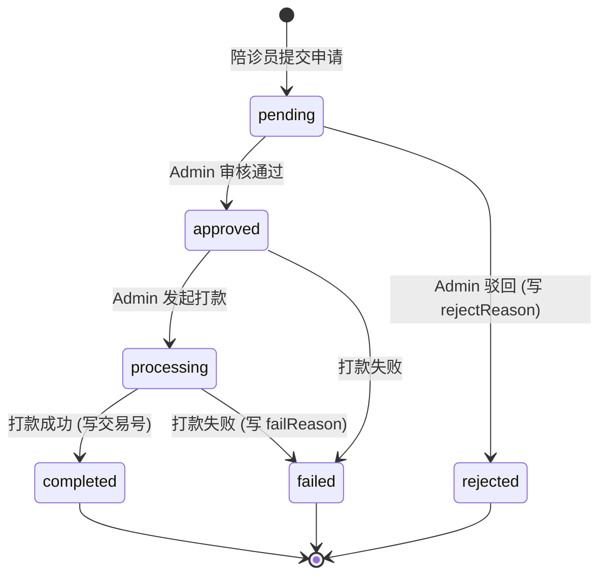

# 陪诊员资金域总设计图

> **版本**: v2.0  
> **最后更新**: 2025-12-13  
> **关联文档**: [02-API接口契约.md](./02-API接口契约.md) · [03-任务卡拆解.md](./03-任务卡拆解.md) · [04-P2审核打款设计.md](./04-P2审核打款设计.md) · [07-安全审计报告.md](./07-安全审计报告.md)

---

## 目标

把"提现相关的一切"收敛成一个**可扩展、可审计、低风险**的资金域。

## 边界原则（三条铁律）

| # | 原则 | 说明 |
|---|------|------|
| 1 | **终端只发起，不裁决** | 陪诊员端永远不能改提现状态 |
| 2 | **后台是资金真相源** | 状态机、打款、失败原因、审计日志全部在 Admin 域 |
| 3 | **强状态机 + 强审计** | 任何资金动作必须可追溯 |

---

## 1. 领域边界与通道

### Bounded Context

| Context | 责任 | Token/通道 | 写权限 |
|---------|------|------------|--------|
| **Escort App**<br>（陪诊员工作台） | 发起提现、查看自己的提现记录 | `escortRequest`<br>`/escort-app/**` | ❌ 禁止写入提现状态 |
| **Admin Console**<br>（系统后台） | 审核、打款、导出、查询任意陪诊员提现 | `adminRequest`<br>`/admin/**` | ✅ **唯一**写入状态的地方 |
| **Settlement**<br>（结算/财务内核） | 佣金入账、可提现余额结算、冻结/解冻 | 内部服务/事件驱动 | ✅ 写余额、写结算流水 |

### 通道隔离图

```
┌─────────────────────────────────────────────────────────────┐
│                        陪诊员终端                            │
│  ┌─────────────────────────────────────────────────────┐   │
│  │  escortRequest(/escort-app/**)                      │   │
│  │  • 发起提现申请 (POST /withdraw/requests)           │   │
│  │  • 查看自己的记录 (GET /withdraw/records)           │   │
│  │  • ❌ 禁止：修改状态、审核、打款                     │   │
│  └─────────────────────────────────────────────────────┘   │
└─────────────────────────────────────────────────────────────┘
                              │
                              ▼
┌─────────────────────────────────────────────────────────────┐
│                         后端服务                             │
│  ┌─────────────────────────────────────────────────────┐   │
│  │  状态机校验 + 审计日志 + 台账记录                    │   │
│  └─────────────────────────────────────────────────────┘   │
└─────────────────────────────────────────────────────────────┘
                              │
                              ▼
┌─────────────────────────────────────────────────────────────┐
│                        管理后台                              │
│  ┌─────────────────────────────────────────────────────┐   │
│  │  adminRequest(/admin/escorts/withdraw-records/**)   │   │
│  │  • 查看任意记录 (GET /admin/escorts/withdraw-records) │   │
│  │  • 导出 (GET /withdraw-records/export)              │   │
│  │  • ✅ 审核 (POST /withdraw-records/:id/review)      │   │
│  │  • ✅ 打款 (POST /withdraw-records/:id/payout)      │   │
│  └─────────────────────────────────────────────────────┘   │
└─────────────────────────────────────────────────────────────┘
```

---

## 2. 核心对象模型（数据库）

### 2.1 EscortWallet（陪诊员钱包）

```typescript
interface EscortWallet {
  id: string
  escortId: string
  balance: Decimal           // 可提现余额
  frozenBalance: Decimal     // 冻结余额（提现中）
  totalEarned: Decimal       // 累计收入
  totalWithdrawn: Decimal    // 累计已提现
}
```

### 2.2 Withdrawal（提现申请）

```typescript
interface Withdrawal {
  id: string
  walletId: string
  amount: Decimal            // 提现金额
  fee: Decimal               // 手续费
  actualAmount: Decimal      // 实际到账 = amount - fee
  method: 'wechat' | 'alipay' | 'bank'
  account: string            // 收款账户
  status: WithdrawStatus
  
  // 审核信息
  reviewedAt?: Date
  reviewedBy?: string
  reviewNote?: string
  
  // 打款信息
  transferNo?: string        // 交易号
  transferAt?: Date          // 打款时间
  failReason?: string        // 失败原因
  
  createdAt: Date
  updatedAt: Date
  
  // 关联
  logs: WithdrawLog[]
}

type WithdrawStatus = 
  | 'pending'      // 待审核
  | 'approved'     // 已审核
  | 'rejected'     // 已驳回
  | 'processing'   // 打款中
  | 'completed'    // 已完成
  | 'failed'       // 打款失败
```

### 2.3 WithdrawLog（操作日志）

```typescript
interface WithdrawLog {
  id: string
  withdrawId: string
  action: 'create' | 'approve' | 'reject' | 'payout' | 'complete' | 'fail'
  operator: 'system' | 'admin'
  operatorId?: string
  operatorName?: string
  message?: string
  oldStatus?: string
  newStatus?: string
  createdAt: Date
}
```

### 2.4 AdminAuditLog（审计日志）

```typescript
interface AdminAuditLog {
  id: string
  adminId?: string
  adminName?: string
  module: 'withdraw' | 'refund' | 'settlement'
  action: 'export' | 'approve' | 'reject' | 'payout' | 'fail'
  targetId?: string
  targetType?: string
  detail?: string      // JSON
  filters?: string     // JSON（导出筛选条件）
  ip?: string
  userAgent?: string
  createdAt: Date
}
```

### 2.5 WalletTransaction（钱包流水）

```typescript
interface WalletTransaction {
  id: string
  walletId: string
  type: 'income' | 'bonus' | 'frozen' | 'unfrozen' | 'withdraw'
  amount: Decimal
  balanceAfter: Decimal
  withdrawId?: string
  title: string
  remark?: string
  createdAt: Date
}
```

---

## 3. 资金状态机（提现）

### 设计意图

禁止任意跳转，避免"补丁式状态"导致财务对不上账。

### 状态流转图



### 后端状态机定义（已实现）

```typescript
const WITHDRAW_STATE_MACHINE = {
  pending: ['approved', 'rejected'],
  approved: ['processing', 'failed'],
  processing: ['completed', 'failed'],
  // 终态，不可变更
  completed: [],
  rejected: [],
  failed: [],
};

function validateStateTransition(currentStatus: string, targetStatus: string): boolean {
  const allowedTransitions = WITHDRAW_STATE_MACHINE[currentStatus] || [];
  return allowedTransitions.includes(targetStatus);
}
```

### 状态流转表

| 当前状态 | 目标状态 | 触发者 | 必填字段 | 附带操作 |
|----------|----------|--------|----------|----------|
| `pending` | `approved` | Admin | - | 写 WithdrawLog + AdminAuditLog |
| `pending` | `rejected` | Admin | `rejectReason` | 解冻余额 + 写流水 + 写日志 |
| `approved` | `processing` | Admin | - | 写日志 |
| `approved` | `failed` | Admin | `failReason` | 解冻余额 + 写流水 + 写日志 |
| `processing` | `completed` | Admin | `transactionNo` | 扣减冻结 + 累计提现 + 写日志 |
| `processing` | `failed` | Admin | `failReason` | 解冻余额 + 写流水 + 写日志 |

### 🚫 禁止的状态跳转（返回 409）

```typescript
// ❌ 后端必须拒绝以下跳转
pending → completed      // 必须经过 approved + processing
pending → processing     // 必须先 approved
rejected → approved      // 终态不可逆
failed → completed       // 终态不可逆
completed → *            // 终态不可逆
```

### 关键护栏

| 规则 | 说明 | 实现状态 |
|------|------|----------|
| **交易号必填** | `processing → completed` 必须伴随 `transactionNo` | ✅ 已实现 |
| **失败原因必填** | `→ failed` 必须伴随 `failReason` | ✅ 已实现 |
| **驳回原因必填** | `→ rejected` 必须伴随 `rejectReason` | ✅ 已实现 |
| **CONFIRM 确认** | 打款操作必须输入 `CONFIRM` | ✅ 已实现 |
| **交易号唯一** | 防止重复打款 | ✅ 已实现 |

---

## 4. 余额与台账（Ledger）规则

### 4.1 钱包字段说明

| 字段 | 说明 | 变更时机 |
|------|------|----------|
| `balance` | 可提现余额 | 订单完成+、提现申请-、驳回/失败+ |
| `frozenBalance` | 冻结余额 | 提现申请+、打款成功-、驳回/失败- |
| `totalWithdrawn` | 累计已提现 | 打款成功+ |

### 4.2 提现对钱包的影响

| 时点 | 行为 | 钱包变化 | 流水类型 |
|------|------|----------|----------|
| 提现提交 | `pending` 创建 | `balance -= amount`<br>`frozenBalance += amount` | `frozen` |
| 审核驳回 | `rejected` | `balance += amount`<br>`frozenBalance -= amount` | `unfrozen` |
| 打款成功 | `completed` | `frozenBalance -= amount`<br>`totalWithdrawn += netAmount` | - |
| 打款失败 | `failed` | `balance += amount`<br>`frozenBalance -= amount` | `unfrozen` |

### 4.3 流水示例

```
时间          类型        金额      余额变化    说明
─────────────────────────────────────────────────────────────
12-01 10:00  income      +500.00   500.00     订单佣金
12-05 14:00  income      +300.00   800.00     订单佣金
12-10 09:00  frozen      -400.00   400.00     发起提现，冻结
12-10 11:00  (打款成功)    -        400.00     打款成功，扣减冻结
─────────────────────────────────────────────────────────────
                         当前可提现余额: 400.00
                         累计已提现: 400.00
```

---

## 5. API 设计总览

### 5.1 Escort App（仅自查 + 发起）

| API | 路径 | 说明 |
|-----|------|------|
| 获取提现页统计 | `GET /escort-app/withdraw/stats` | 可提现、处理中、规则、账户 |
| 获取提现记录列表 | `GET /escort-app/withdraw/records` | 仅本人记录 |
| 发起提现申请 | `POST /escort-app/withdraw/requests` | 只允许创建 `pending` |
| 获取提现详情 | `GET /escort-app/withdraw/records/:id` | 仅本人 |

### 5.2 Admin Console（资金真相源）

| API | 路径 | 说明 | 状态 |
|-----|------|------|------|
| 提现记录列表 | `GET /admin/escorts/withdraw-records` | 支持筛选/分页 | ✅ P0 |
| 提现统计 | `GET /admin/escorts/withdraw-records/stats` | 待处理/已完成统计 | ✅ P0 |
| 提现记录详情 | `GET /admin/escorts/withdraw-records/:id` | 基础详情 | ✅ P1 |
| 提现详情（含日志）| `GET /admin/escorts/withdraw-records/:id/detail` | 含操作日志 | ✅ P2 |
| 操作日志 | `GET /admin/escorts/withdraw-records/:id/logs` | 仅日志 | ✅ P2 |
| 导出 | `GET /admin/escorts/withdraw-records/export` | CSV/Excel | ✅ P1 |
| 审核 | `POST /admin/escorts/withdraw-records/:id/review` | 通过/驳回 | ✅ P2 |
| 打款 | `POST /admin/escorts/withdraw-records/:id/payout` | 🔴 高危 | ✅ P2 |
| 标记失败 | `POST /admin/escorts/withdraw-records/:id/fail` | 手动标记 | ✅ P2 |

---

## 6. 后台 UI 信息架构

### 6.1 页面结构

```
/admin
├── /escorts                           # 陪诊员管理
│   ├── (list)                         # 列表页
│   └── /:id                           # 详情页
│       ├── Tab: 基础信息
│       ├── Tab: 订单
│       ├── Tab: 收入
│       └── Tab: 提现记录              ← ✅ ADMIN-WD-04
│
└── /escorts/withdraw-records          # 提现记录中心
    ├── (list)                         # 列表页 ← ✅ ADMIN-WD-01
    │   ├── 筛选
    │   ├── 分页
    │   ├── 导出                       ← ✅ ADMIN-WD-03
    │   └── 查看详情 → Drawer          ← ✅ ADMIN-WD-02
    │
    ├── Drawer: 详情抽屉 (只读)
    │   ├── 基础信息
    │   ├── 金额信息
    │   ├── 账户信息
    │   ├── 状态信息
    │   └── 操作日志                   ← ✅ FE-WD-P2-03
    │
    ├── Drawer: 审核抽屉               ← ✅ FE-WD-P2-01
    │   ├── 申请信息（只读）
    │   ├── 审核决策（通过/驳回）
    │   └── 驳回原因（驳回时必填）
    │
    └── Modal: 打款确认                ← ✅ FE-WD-P2-02
        ├── 危险警告
        ├── 打款信息确认
        ├── CONFIRM 输入框（禁止粘贴）
        └── 打款方式选择
```

### 6.2 组件清单

| 组件 | 文件 | 说明 | 状态 |
|------|------|------|------|
| 详情抽屉 | `WithdrawDetailDrawer.tsx` | 只读详情 | ✅ |
| 导出按钮 | `WithdrawExportButton.tsx` | CSV/Excel 导出 | ✅ |
| 可复用列表 | `WithdrawRecordList.tsx` | 详情页 Tab 复用 | ✅ |
| 审核抽屉 | `WithdrawReviewDrawer.tsx` | 通过/驳回 | ✅ |
| 打款弹窗 | `WithdrawPayoutModal.tsx` | 高危确认 | ✅ |
| 操作日志时间线 | `WithdrawLogsTimeline.tsx` | 日志展示 | ✅ |
| 权限控制 | `withdrawPermissions.ts` | 按钮可见性 | ✅ |

---

## 7. 权限与审计

### 7.1 权限分层

| 权限代码 | 能力 | 角色建议 |
|----------|------|----------|
| `withdraw.read` | 查看列表/详情 | 客服、财务、运营 |
| `withdraw.export` | 导出 | 财务、运营 |
| `withdraw.approve` | 审核通过/驳回 | 风控主管、财务 |
| `withdraw.payout` | 发起打款 | 财务主管 |

### 7.2 前端权限控制

```typescript
// withdrawPermissions.ts
export function canShowAction(
  status: AdminWithdrawStatus,
  permissions: WithdrawPermissions,
  action: WithdrawActionType
): boolean {
  if (action === 'review') {
    return status === 'pending' && permissions.approve
  }
  if (action === 'payout') {
    return status === 'approved' && permissions.payout
  }
  return false
}
```

核心规则：
- **无权限不渲染按钮**（非 disabled）
- `review`: `pending` + `approve` 权限
- `payout`: `approved` + `payout` 权限

### 7.3 审计日志

以下动作必须写 `WithdrawLog` + `AdminAuditLog`：

| 动作 | WithdrawLog.action | AdminAuditLog.action |
|------|-------------------|---------------------|
| 导出 | - | `export` |
| 审核通过 | `approve` | `approve` |
| 审核驳回 | `reject` | `reject` |
| 发起打款 | `payout` | `payout` |
| 打款成功 | `complete` | - |
| 打款失败 | `fail` | `fail` |

---

## 8. 数据脱敏

### 8.1 脱敏函数（已实现）

```typescript
// 手机号脱敏
function maskPhone(phone: string): string {
  if (!phone || phone.length < 7) return phone;
  return phone.slice(0, 3) + '****' + phone.slice(-4);
}
// 13812345678 → 138****5678

// 账户脱敏
function maskAccount(account: string): string {
  if (!account || account.length < 4) return account;
  return '****' + account.slice(-4);
}
// 6228480012345678 → ****5678
```

### 8.2 脱敏场景

| 场景 | 字段 | 处理 |
|------|------|------|
| 列表展示 | `escortPhoneMasked` | 脱敏 |
| 列表展示 | `accountMasked` | 脱敏 |
| 导出 CSV | 手机号、账户 | 脱敏 |
| 审计日志 | 敏感数据 | 不记录完整值 |

---

## 9. 风险清单与硬护栏

### 9.1 典型风险

| 风险 | 后果 | 防护措施 | 状态 |
|------|------|----------|------|
| **重复打款** | 资金损失 | 交易号唯一约束 + 幂等设计 | ✅ |
| **状态与余额不一致** | 财务对不上账 | 强台账 + 状态机 | ✅ |
| **终端越权改状态** | 绕过审批 | 通道隔离 + 后端校验 | ✅ |
| **导出泄露敏感信息** | 隐私合规风险 | 脱敏 + 审计日志 | ✅ |
| **打款到错误账户** | 资金损失 | 二次确认（CONFIRM） | ✅ |
| **状态跳转** | 流程混乱 | 状态机强校验 | ✅ |

### 9.2 硬护栏（已实现）

```typescript
// 1. 仅 Admin 域可写状态
@Controller('admin/escorts/withdraw-records')

// 2. 状态机校验
if (!validateStateTransition(withdrawal.status, targetStatus)) {
  throw new ConflictException(`状态转换非法: ${withdrawal.status} → ${targetStatus}`);
}

// 3. 交易号唯一约束
const existing = await prisma.withdrawal.findFirst({
  where: { transferNo: transactionNo, id: { not: id } },
});
if (existing) {
  throw new ConflictException('交易号已存在，请检查是否重复打款');
}

// 4. CONFIRM 二次确认
if (operatorConfirmText !== 'CONFIRM') {
  throw new BadRequestException('确认文本不匹配，请输入 CONFIRM');
}

// 5. 事务保护
await prisma.$transaction(async (tx) => {
  // 状态变更 + 钱包更新 + 日志记录
});
```

---

## 10. 完成状态

| 优先级 | 交付物 | 任务卡 | 状态 |
|--------|--------|--------|------|
| **P0** | 后台提现记录列表页 | ADMIN-WD-01 | ✅ 已完成 |
| **P1-1** | 详情抽屉（只读） | ADMIN-WD-02 | ✅ 已完成 |
| **P1-2** | 导出 CSV/Excel | ADMIN-WD-03 | ✅ 已完成 |
| **P1-3** | 陪诊员详情页 Tab | ADMIN-WD-04 | ✅ 已完成 |
| **P2-BE** | 状态机 + 审核 API + 打款 API | BE-WD-P2-01~04 | ✅ 已完成 |
| **P2-FE** | 审核 Drawer + 打款 Modal + 日志 | FE-WD-P2-01~04 | ✅ 已完成 |
| **P2-QA** | 回归测试 + 安全审计 | QA/SEC-WD-P2 | ✅ 已完成 |

---

## 附录：一句话总结

```
┌─────────────────────────────────────────────────────┐
│                                                     │
│   终端（陪诊员） → 只负责"发起请求"                  │
│   后台（Admin）  → 才是"资金真相源"                  │
│                                                     │
└─────────────────────────────────────────────────────┘
```

这套设计保证：
- ✅ 不管前端怎么抖动，资金流向始终清晰可追溯
- ✅ 不会反噬前端架构，不会破坏双会话模型
- ✅ 权限分明，审计完整，合规可查
- ✅ 状态机保护，防止非法状态跳转
- ✅ 二次确认，防止误操作
