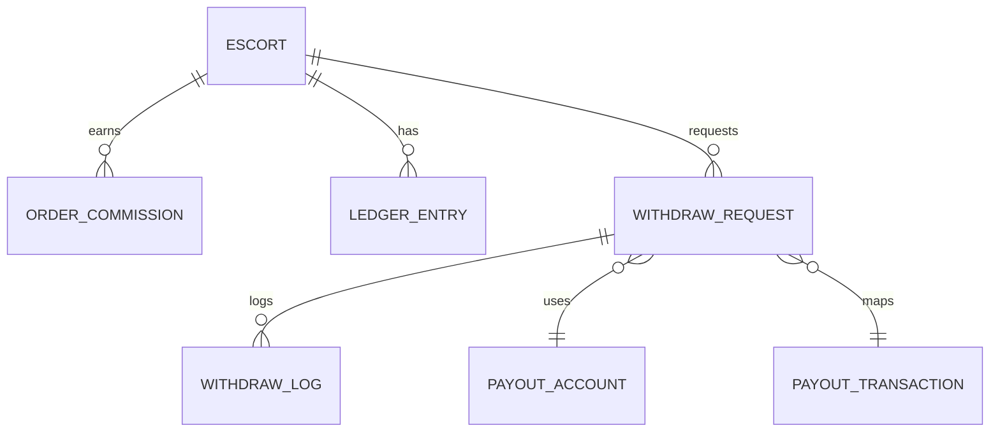
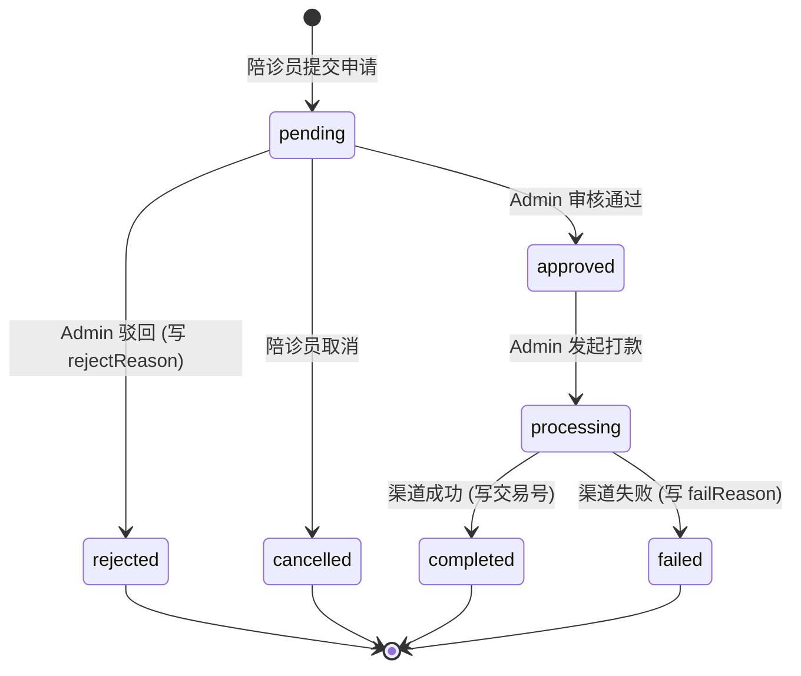

# 陪诊员资金域总设计图

> **版本**: v1.0  
> **最后更新**: 2024-12-12  
> **关联文档**: [02-API接口契约.md](./02-API接口契约.md) · [03-任务卡拆解.md](./03-任务卡拆解.md) · [04-P2审核打款设计.md](./04-P2审核打款设计.md)

---

## 目标

把"提现相关的一切"收敛成一个**可扩展、可审计、低风险**的资金域。

## 边界原则（三条铁律）

| # | 原则 | 说明 |
|---|------|------|
| 1 | **终端只发起，不裁决** | 陪诊员端永远不能改提现状态 |
| 2 | **后台是资金真相源** | 状态机、打款、失败原因、审计日志全部在 Admin 域 |
| 3 | **强状态机 + 强审计** | 任何资金动作必须可追溯 |

---

## 1. 领域边界与通道

### Bounded Context

| Context | 责任 | Token/通道 | 写权限 |
|---------|------|------------|--------|
| **Escort App**<br>（陪诊员工作台） | 发起提现、查看自己的提现记录 | `escortRequest`<br>`/escort-app/**` | ❌ 禁止写入提现状态 |
| **Admin Console**<br>（系统后台） | 审核、打款、导出、查询任意陪诊员提现 | `adminRequest`<br>`/admin/**` | ✅ **唯一**写入状态的地方 |
| **Settlement**<br>（结算/财务内核，可选） | 佣金入账、可提现余额结算、冻结/解冻 | 内部服务/事件驱动 | ✅ 写余额、写结算流水 |

### 通道隔离图

```
┌─────────────────────────────────────────────────────────────┐
│                        陪诊员终端                            │
│  ┌─────────────────────────────────────────────────────┐   │
│  │  escortRequest(/escort-app/**)                      │   │
│  │  • 发起提现申请 (POST /withdraw/requests)           │   │
│  │  • 查看自己的记录 (GET /withdraw/records)           │   │
│  │  • ❌ 禁止：修改状态、审核、打款                     │   │
│  └─────────────────────────────────────────────────────┘   │
└─────────────────────────────────────────────────────────────┘
                              │
                              ▼
┌─────────────────────────────────────────────────────────────┐
│                         后端服务                             │
│  ┌─────────────────────────────────────────────────────┐   │
│  │  状态机校验 + 审计日志 + 台账记录                    │   │
│  └─────────────────────────────────────────────────────┘   │
└─────────────────────────────────────────────────────────────┘
                              │
                              ▼
┌─────────────────────────────────────────────────────────────┐
│                        管理后台                              │
│  ┌─────────────────────────────────────────────────────┐   │
│  │  adminRequest(/admin/**)                            │   │
│  │  • 查看任意记录 (GET /withdraw-records)             │   │
│  │  • 导出 (GET /withdraw-records/export)              │   │
│  │  • ✅ 审核 (POST /withdraw/:id/approve)             │   │
│  │  • ✅ 打款 (POST /withdraw/:id/payout)              │   │
│  └─────────────────────────────────────────────────────┘   │
└─────────────────────────────────────────────────────────────┘
```

---

## 2. 核心对象模型（概念 ER）



### 2.1 ESCORT（陪诊员）

```typescript
interface Escort {
  id: string
  name: string
  phoneMasked: string    // 138****8888
  level: string          // 等级
}
```

### 2.2 LEDGER_ENTRY（台账条目）

```typescript
interface LedgerEntry {
  id: string
  escortId: string
  type: LedgerType
  amount: number         // 正数=入账，负数=扣减
  refType: string        // 关联类型
  refId: string          // 关联 ID
  createdAt: string
}

type LedgerType =
  | 'order'              // 订单收入
  | 'bonus'              // 奖励
  | 'adjust'             // 调整
  | 'withdraw_hold'      // 提现冻结
  | 'withdraw_done'      // 提现完成
  | 'withdraw_fail'      // 提现失败（释放）
  | 'manual_adjust'      // [P2/未来] 人工调账（仅 superadmin，用于线下极端纠错）
```

### 2.3 WITHDRAW_REQUEST（提现申请）

```typescript
interface WithdrawRequest {
  id: string
  withdrawNo: string     // 提现单号 WD202412120001
  escortId: string
  amount: number         // 提现金额
  fee: number            // 手续费
  netAmount: number      // 实际到账 = amount - fee
  status: WithdrawStatus
  failReason?: string    // 仅 rejected/failed 时有值
  createdAt: string      // 申请时间
  approvedAt?: string    // 审核时间
  paidAt?: string        // 打款时间
}

type WithdrawStatus = 
  | 'pending'      // 待审核
  | 'approved'     // 已审核
  | 'rejected'     // 已驳回
  | 'processing'   // 打款中
  | 'completed'    // 已完成
  | 'failed'       // 打款失败
  | 'cancelled'    // 已取消
```

### 2.4 WITHDRAW_LOG（操作日志）

```typescript
interface WithdrawLog {
  id: string
  withdrawId: string
  action: 'create' | 'submit' | 'approve' | 'reject' | 'payout' | 'success' | 'fail'
  operatorType: 'system' | 'admin'
  operatorName?: string  // admin 时填写
  message?: string
  createdAt: string
}
```

### 2.5 PAYOUT_ACCOUNT（收款账户）

```typescript
interface PayoutAccount {
  id: string
  escortId: string
  type: 'bank' | 'alipay' | 'wechat'
  accountNoMasked: string  // 脱敏 622****1234
  bankName?: string
  isDefault: boolean
}
```

### 2.6 PAYOUT_TRANSACTION（打款交易）

```typescript
interface PayoutTransaction {
  id: string
  withdrawId: string
  channel: 'alipay' | 'wechat' | 'bank'
  transactionNo: string      // 第三方交易号（唯一约束）
  rawResponseMasked: string  // 渠道原始回执（脱敏）
  createdAt: string
}
```

---

## 3. 资金状态机（提现）

### 设计意图

禁止任意跳转，避免"补丁式状态"导致财务对不上账。

### 状态流转图



### 状态流转表

| 当前状态 | 目标状态 | 触发者 | 必填字段 |
|----------|----------|--------|----------|
| `pending` | `approved` | Admin | - |
| `pending` | `rejected` | Admin | `rejectReason` |
| `pending` | `cancelled` | Escort | - |
| `approved` | `processing` | Admin | - |
| `processing` | `completed` | System | `transactionNo` |
| `processing` | `failed` | System | `failReason` |

### 🚫 禁止的状态跳转

```typescript
// ❌ 后端必须拒绝以下跳转
pending → completed      // 必须经过 approved + processing
pending → processing     // 必须先 approved
approved → completed     // 必须先 processing
rejected → approved      // 终态不可逆
failed → completed       // 终态不可逆
```

### 关键护栏

| 规则 | 说明 |
|------|------|
| **交易号必填** | `processing → completed` 必须伴随 `transactionNo` |
| **失败原因必填** | `processing → failed` 必须伴随 `failReason` |
| **禁止自动重试** | `failed` 不自动重试，避免重复打款 |
| **重试走审计** | 重试必须走 P2 操作流（重新发起打款并写审计） |

---

## 4. 余额与台账（Ledger）规则

### 4.1 核心理念

> **"余额"不是字段，是台账的视图**

```typescript
// 可提现余额 = 所有入账 - 所有扣减
const availableBalance = ledgerEntries
  .filter(e => INCOME_TYPES.includes(e.type))
  .reduce((sum, e) => sum + e.amount, 0)
  - ledgerEntries
  .filter(e => DEDUCTION_TYPES.includes(e.type))
  .reduce((sum, e) => sum + Math.abs(e.amount), 0)
```

### 4.2 提现对台账的影响

| 时点 | 行为 | Ledger Entry |
|------|------|--------------|
| 提现提交 | `pending` 创建 | `withdraw_hold = -amount`（冻结） |
| 审核驳回 | `rejected` | `withdraw_hold = +amount`（反向冲回） |
| 打款成功 | `completed` | `withdraw_done = -amount`（确认扣减） |
| 打款失败 | `failed` | `withdraw_fail = +amount`（释放冻结） |

### 4.3 台账流水示例

```
时间          类型              金额      余额变化    说明
─────────────────────────────────────────────────────────────
12-01 10:00  order            +500.00   500.00     订单佣金
12-05 14:00  order            +300.00   800.00     订单佣金
12-10 09:00  withdraw_hold    -400.00   400.00     发起提现，冻结
12-10 11:00  withdraw_done    -400.00   400.00     打款成功，确认扣减
─────────────────────────────────────────────────────────────
                              当前可提现余额: 400.00
```

---

## 5. API 设计总览

### 5.1 Escort App（仅自查 + 发起）

| API | 路径 | 说明 |
|-----|------|------|
| 获取提现页统计 | `GET /escort-app/withdraw/stats` | 可提现、处理中、规则、账户、最近记录 |
| 获取提现记录列表 | `GET /escort-app/withdraw/records` | 仅本人记录，分页/筛选 |
| 发起提现申请 | `POST /escort-app/withdraw/requests` | 只允许创建 `pending` |
| 获取提现详情 | `GET /escort-app/withdraw/records/:id` | 仅本人，包含状态与必要字段 |

#### 接口示例：提现页统计

```typescript
// GET /escort-app/withdraw/stats
interface WithdrawStatsResponse {
  availableBalance: number      // 可提现余额
  processingAmount: number      // 处理中金额
  totalWithdrawn: number        // 累计已提现
  
  withdrawRule: {
    minAmount: number           // 最低提现金额
    maxAmount: number           // 单笔上限
    feeRate: number             // 手续费率
    minFee: number              // 最低手续费
  }
  
  payoutAccounts: PayoutAccount[]  // 收款账户列表
  
  recentRecords: WithdrawRecord[]  // 最近 5 条记录
}
```

### 5.2 Admin Console（资金真相源）

| API | 路径 | 说明 |
|-----|------|------|
| 提现记录列表 | `GET /admin/escorts/withdraw-records` | 支持筛选/分页 |
| 提现记录详情 | `GET /admin/escorts/withdraw-records/:id` | 含 failReason、交易号、日志 |
| 导出 | `GET /admin/escorts/withdraw-records/export` | `?format=csv\|xlsx` |
| 陪诊员维度查询 | `GET /admin/escorts/:escortId/withdraw-records` | 详情页 Tab 复用 |
| 审核通过 | `POST /admin/withdraw/:id/approve` | P2，需权限 |
| 审核驳回 | `POST /admin/withdraw/:id/reject` | P2，需 reason |
| 发起打款 | `POST /admin/withdraw/:id/payout` | P2，需二次确认 |

---

## 6. 后台 UI 信息架构

### 6.1 页面结构

```
/admin
├── /escorts                           # 陪诊员管理
│   ├── (list)                         # 列表页
│   └── /:id                           # 详情页
│       ├── Tab: 基础信息
│       ├── Tab: 订单
│       ├── Tab: 收入
│       └── Tab: 提现记录 (P1)         ← ADMIN-WD-04
│
└── /escorts/withdraw-records          # 提现记录中心 (P0)
    ├── (list)                         # 列表页 ← ADMIN-WD-01
    │   ├── 筛选
    │   ├── 分页
    │   ├── 导出 (P1)                  ← ADMIN-WD-03
    │   └── 查看详情 → Drawer (P1)     ← ADMIN-WD-02
    │
    └── Drawer: 详情抽屉 (只读)
        ├── 基础信息
        ├── 金额信息
        ├── 账户信息
        ├── 状态信息
        └── 操作日志
```

### 6.2 列表页筛选器

```typescript
interface WithdrawRecordFilters {
  status?: WithdrawStatus           // 状态筛选
  dateRange?: '7d' | '30d' | 'custom'  // 时间范围
  startDate?: string                // 自定义开始
  endDate?: string                  // 自定义结束
  escortId?: string                 // 陪诊员 ID
  keyword?: string                  // 单号/手机/交易号
}
```

---

## 7. 权限与审计

### 7.1 权限分层

| 权限代码 | 能力 | 角色建议 |
|----------|------|----------|
| `withdraw.read` | 查看列表/详情 | 客服、财务、风控 |
| `withdraw.export` | 导出 | 财务、运营 |
| `withdraw.approve` | 审核通过/驳回 | 风控主管 |
| `withdraw.payout` | 发起打款 | 财务主管 |
| `withdraw.admin` | 全权限 | 超级管理员 |

### 7.2 审计日志（强制）

以下动作必须写 `WITHDRAW_LOG` + `ADMIN_AUDIT_LOG`：

| 动作 | 日志内容 |
|------|----------|
| **导出** | 谁导出、筛选条件、导出条数 |
| **审核通过** | 操作人、时间、目标记录 |
| **审核驳回** | 操作人、时间、驳回原因 |
| **发起打款** | 操作人、时间、金额、账户 |
| **打款成功** | 交易号、渠道、时间 |
| **打款失败** | 失败原因、渠道回执 |

### 7.3 审计日志示例

```json
{
  "id": "log_001",
  "withdrawId": "wd_001",
  "action": "approve",
  "operatorType": "admin",
  "operatorId": "admin_001",
  "operatorName": "张三",
  "message": "审核通过",
  "metadata": {
    "ip": "192.168.1.100",
    "userAgent": "Chrome/120"
  },
  "createdAt": "2024-12-12T10:00:00Z"
}
```

---

## 8. 筛选与路由参数规范

### 8.1 queryKey 设计

```typescript
// 列表页 queryKey
const queryKey = [
  'admin',
  'withdraw-records',
  {
    status,
    dateRange,
    startDate,
    endDate,
    escortId,
    keyword,
    page,
    pageSize,
  },
]

// 详情页 Tab queryKey
const queryKey = [
  'admin',
  'withdraw-records',
  {
    escortId,    // 固定
    page,
    pageSize,
    status,
  },
]
```

### 8.2 前端规范

| 规范 | 说明 |
|------|------|
| **筛选驱动 queryKey** | 筛选变化必须驱动 queryKey 变化 |
| **禁止手动 refetch** | 避免手动 refetch 造成竞态 |
| **URL 同步** | 筛选条件同步到 URL，支持分享/刷新 |

---

## 9. 风险清单与硬护栏

### 9.1 典型风险

| 风险 | 后果 | 防护措施 |
|------|------|----------|
| **重复打款** | 资金损失 | 交易号唯一约束 + 幂等设计 |
| **状态与余额不一致** | 财务对不上账 | 强台账 + 状态机 |
| **终端越权改状态** | 绕过审批 | 通道隔离 + 后端校验 |
| **导出泄露敏感信息** | 隐私合规风险 | 脱敏 + 审计日志 |
| **打款到错误账户** | 资金损失 | 二次确认 + 账户核验 |

### 9.2 硬护栏（必须实现）

```typescript
// 1. 仅 Admin 域可写状态
if (context !== 'admin') {
  throw new ForbiddenError('终端禁止修改提现状态')
}

// 2. 状态机校验
if (!isValidTransition(currentStatus, targetStatus)) {
  throw new BadRequestError(`非法状态跳转: ${currentStatus} → ${targetStatus}`)
}

// 3. 交易号唯一约束
@Unique(['transactionNo'])
class PayoutTransaction { ... }

// 4. 敏感字段脱敏
function maskPhone(phone: string): string {
  return phone.replace(/(\d{3})\d{4}(\d{4})/, '$1****$2')
}

// 5. 导出审计
await auditLog.create({
  action: 'export',
  operator: currentAdmin,
  metadata: { filters, count },
})
```

---

## 10. P0/P1/P2 路线图

| 优先级 | 交付物 | 任务卡 | 状态 |
|--------|--------|--------|------|
| **P0** | 后台提现记录列表页 | ADMIN-WD-01 | ✅ 已完成 |
| **P1-1** | 详情抽屉（只读） | ADMIN-WD-02 | ⏳ 待开发 |
| **P1-2** | 导出 CSV/Excel | ADMIN-WD-03 | ⏳ 待开发 |
| **P1-3** | 陪诊员详情页 Tab | ADMIN-WD-04 | ⏳ 待开发 |
| **P2** | 人工审核/打款流 | ADMIN-WD-05 | 📋 待设计 |

---

## 附录：一句话总结

```
┌─────────────────────────────────────────────────────┐
│                                                     │
│   终端（陪诊员） → 只负责"发起请求"                  │
│   后台（Admin）  → 才是"资金真相源"                  │
│                                                     │
└─────────────────────────────────────────────────────┘
```

这套设计保证：
- ✅ 不管前端怎么抖动，资金流向始终清晰可追溯
- ✅ 不会反噬前端架构，不会破坏双会话模型
- ✅ 权限分明，审计完整，合规可查
