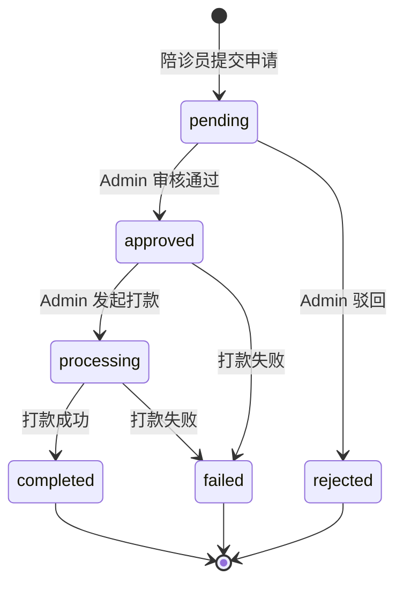

# 后台陪诊员提现模块 - API 接口契约

> **版本**: v2.0  
> **最后更新**: 2025-12-13  
> **适用范围**: Admin Console  
> **关联文档**: [01-资金域总设计图.md](./01-资金域总设计图.md) · [03-任务卡拆解.md](./03-任务卡拆解.md) · [04-P2审核打款设计.md](./04-P2审核打款设计.md)  
> **资金真源**: 后台（仅 Admin 可写状态）  
> **强约束**: 状态机 + 审计日志

---

## 1. 基础约定

### 1.1 统一前缀

```
/admin/escorts/withdraw-records
```

> 兼容旧路由 `/admin/withdrawals`（即将废弃）

### 1.2 权限 Header

```http
Authorization: Bearer <adminToken>
X-Admin-Id: admin_xxx
X-Admin-Name: 张三
```

### 1.3 通用响应格式

```typescript
// 成功响应
interface SuccessResponse<T> {
  code: 0
  data: T
  message?: string
}

// 错误响应
interface ErrorResponse {
  code: number
  message: string
  details?: Record<string, string>  // 字段级错误
}
```

---

## 2. 提现记录列表（P0）✅

### 请求

```http
GET /admin/escorts/withdraw-records
```

### Query 参数

| 参数 | 类型 | 必填 | 说明 |
|------|------|------|------|
| `page` | number | 否 | 默认 1 |
| `pageSize` | number | 否 | 默认 10，最大 100 |
| `status` | enum | 否 | `pending`/`approved`/`processing`/`completed`/`failed`/`rejected` |
| `method` | enum | 否 | `bank`/`alipay`/`wechat` |
| `startAt` | string | 否 | 申请时间起 YYYY-MM-DD |
| `endAt` | string | 否 | 申请时间止 YYYY-MM-DD |
| `minAmount` | number | 否 | 最小金额 |
| `maxAmount` | number | 否 | 最大金额 |
| `keyword` | string | 否 | 提现单号/陪诊员ID/手机号 |

### 响应

```typescript
interface WithdrawRecordListResponse {
  data: WithdrawRecordListItem[]
  total: number
  page: number
  pageSize: number
}

interface WithdrawRecordListItem {
  id: string                    // 提现记录 ID
  withdrawNo: string            // 提现单号（ID前8位大写）
  escortId: string              // 陪诊员 ID
  escortName: string            // 陪诊员姓名
  escortPhoneMasked: string     // 手机号（脱敏）138****8888
  amount: number                // 提现金额
  fee: number                   // 手续费
  netAmount: number             // 实际到账
  method: 'bank' | 'alipay' | 'wechat'  // 提现方式
  accountMasked: string         // 账户（脱敏）****6789
  bankName?: string             // 银行名称（仅 bank）
  status: WithdrawStatus        // 状态
  createdAt: string             // 申请时间 ISO8601
  paidAt?: string               // 打款时间
  failReason?: string           // 失败原因
}
```

### 响应示例

```json
{
  "code": 0,
  "data": {
    "data": [
      {
        "id": "clx123456789",
        "withdrawNo": "CLX12345",
        "escortId": "esc_001",
        "escortName": "王小明",
        "escortPhoneMasked": "138****8888",
        "amount": 500,
        "fee": 0,
        "netAmount": 500,
        "method": "alipay",
        "accountMasked": "****8888",
        "status": "pending",
        "createdAt": "2024-12-12T10:30:00.000Z"
      }
    ],
    "total": 128,
    "page": 1,
    "pageSize": 10
  }
}
```

---

## 3. 提现统计（P0）✅

### 请求

```http
GET /admin/escorts/withdraw-records/stats
```

### 响应

```typescript
interface WithdrawStatsResponse {
  pendingCount: number       // 待审核数量
  pendingAmount: number      // 待审核金额
  approvedCount: number      // 已审核待打款数量
  completedCount: number     // 已完成数量
  completedAmount: number    // 已完成金额
  todayCount: number         // 今日申请数
}
```

---

## 4. 提现详情（P1）✅

### 请求

```http
GET /admin/escorts/withdraw-records/:id
```

### 响应

```typescript
interface WithdrawRecordDetailResponse {
  id: string
  withdrawNo: string
  escortId: string
  escortName: string
  escortPhoneMasked: string
  amount: number
  fee: number
  netAmount: number
  method: 'bank' | 'alipay' | 'wechat'
  accountMasked: string
  bankName?: string
  status: WithdrawStatus
  failReason?: string
  transactionNo?: string
  createdAt: string
  paidAt?: string
  reviewedAt?: string
  reviewNote?: string
}
```

---

## 5. 提现详情（含日志）（P2）✅

### 请求

```http
GET /admin/escorts/withdraw-records/:id/detail
```

### 响应

```typescript
interface WithdrawDetailWithLogsResponse extends WithdrawRecordDetailResponse {
  logs: WithdrawLog[]
}

interface WithdrawLog {
  id: string
  action: 'create' | 'approve' | 'reject' | 'payout' | 'complete' | 'fail'
  operator: 'system' | 'admin'
  operatorName?: string
  message?: string
  createdAt: string
}
```

---

## 6. 提现操作日志（P2）✅

### 请求

```http
GET /admin/escorts/withdraw-records/:id/logs
```

### 响应

```typescript
type WithdrawLogsResponse = WithdrawLog[]
```

---

## 7. 导出接口（P1）✅

### 请求

```http
GET /admin/escorts/withdraw-records/export
```

### Query 参数

与列表接口一致，额外增加：

| 参数 | 类型 | 必填 | 说明 |
|------|------|------|------|
| `format` | enum | 否 | `csv`（默认）/ `xlsx` |

### Headers

```http
X-Admin-Id: admin_xxx
X-Admin-Name: 张三
```

### 响应

- **Content-Type**: `text/csv; charset=utf-8`
- **Content-Disposition**: `attachment; filename*=UTF-8''提现记录_2024-12-12.csv`

### 导出字段

| 列名 | 字段 | 说明 |
|------|------|------|
| 提现单号 | withdrawNo | ID前8位大写 |
| 陪诊员ID | escortId | |
| 陪诊员姓名 | escortName | |
| 手机号 | escortPhoneMasked | 脱敏 |
| 提现金额 | amount | |
| 手续费 | fee | |
| 实际到账 | netAmount | |
| 提现方式 | method | 中文：银行卡/支付宝/微信 |
| 收款账户 | accountMasked | 脱敏 |
| 状态 | status | 中文状态名 |
| 申请时间 | createdAt | |
| 打款时间 | paidAt | |
| 失败原因 | failReason | |

### 审计日志

每次导出**自动**写入 `AdminAuditLog`：

```typescript
{
  module: 'withdraw',
  action: 'export',
  adminId: string,
  adminName: string,
  detail: JSON.stringify({ count, format }),
  filters: JSON.stringify({ status, method, ... })
}
```

---

## 8. 审核接口（P2）✅

### 请求

```http
POST /admin/escorts/withdraw-records/:id/review
```

### Headers

```http
X-Admin-Id: admin_xxx
X-Admin-Name: 张三
```

### Body

```typescript
interface ReviewRequest {
  action: 'approve' | 'reject'
  rejectReason?: string  // 驳回时必填
}
```

### 响应

返回更新后的提现详情

### 状态转换

```
pending → approved  (action: 'approve')
pending → rejected  (action: 'reject', rejectReason 必填)
```

### 业务逻辑

1. **approve**: 更新状态为 `approved`
2. **reject**: 
   - 更新状态为 `rejected`
   - 解冻金额到可用余额
   - 记录解冻流水（`WalletTransaction.type = 'unfrozen'`）

### 审计日志

写入 `WithdrawLog` + `AdminAuditLog`

---

## 9. 打款接口（P2）✅ 🔴 高危

### 请求

```http
POST /admin/escorts/withdraw-records/:id/payout
```

### Headers

```http
X-Admin-Id: admin_xxx
X-Admin-Name: 张三
```

### Body

```typescript
interface PayoutRequest {
  payoutMethod: 'manual' | 'channel'  // 打款方式
  operatorConfirmText: string          // 必须为 'CONFIRM'
  transactionNo?: string               // 交易号（手动打款时填写）
}
```

### 响应

返回更新后的提现详情

### 状态转换

```
approved → processing → completed
```

> 当前实现：手动打款场景下，直接从 `approved` 变为 `completed`

### 业务逻辑

1. **校验确认文本**: `operatorConfirmText !== 'CONFIRM'` → 400
2. **状态机校验**: 当前状态必须是 `approved`
3. **幂等性检查**: `transactionNo` 不能重复
4. **事务操作**:
   - 更新提现状态为 `completed`
   - 记录交易号和打款时间
   - 从冻结余额扣除（`frozenBalance -= amount`）
   - 累计提现金额增加（`totalWithdrawn += netAmount`）
5. **写入日志**: `WithdrawLog`（payout + complete）+ `AdminAuditLog`

### 红线规则

```typescript
/**
 * ⚠️ 打款红线
 * 
 * 1. operatorConfirmText 必须是 'CONFIRM'
 * 2. 前置状态必须是 approved
 * 3. transactionNo 唯一约束，防重复打款
 * 4. 状态变更 + Ledger 在同一事务内
 */
```

---

## 10. 标记失败接口（P2）✅

### 请求

```http
POST /admin/escorts/withdraw-records/:id/fail
```

### Headers

```http
X-Admin-Id: admin_xxx
X-Admin-Name: 张三
```

### Body

```typescript
interface MarkFailedRequest {
  reason: string  // 失败原因（必填）
}
```

### 响应

返回更新后的提现详情

### 状态转换

```
approved → failed
processing → failed
```

### 业务逻辑

1. **状态机校验**: 当前状态必须是 `approved` 或 `processing`
2. **事务操作**:
   - 更新提现状态为 `failed`
   - 记录失败原因
   - 解冻金额到可用余额
   - 记录解冻流水
3. **写入日志**: `WithdrawLog` + `AdminAuditLog`

---

## 11. 错误码规范

| HTTP 状态码 | 含义 |
|------------|------|
| 400 | 参数校验失败（如 CONFIRM 不匹配） |
| 401 | 未登录 / Token 过期 |
| 403 | 无权限 |
| 404 | 提现记录不存在 |
| 409 | 状态冲突（非法状态机跳转） |
| 500 | 系统错误 |

### 错误响应示例

```json
{
  "code": 409,
  "message": "状态转换非法: pending → completed"
}
```

```json
{
  "code": 400,
  "message": "确认文本不匹配，请输入 CONFIRM"
}
```

```json
{
  "code": 400,
  "message": "驳回必须填写原因"
}
```

---

## 12. 状态机规则

### 状态流转图



### 后端状态机定义

```typescript
const WITHDRAW_STATE_MACHINE = {
  pending: ['approved', 'rejected'],
  approved: ['processing', 'failed'],
  processing: ['completed', 'failed'],
  // 终态，不可变更
  completed: [],
  rejected: [],
  failed: [],
};
```

### 非法跳转（返回 409）

```typescript
// ❌ 禁止的跳转
pending → completed      // 必须经过 approved + processing
pending → processing     // 必须先 approved
approved → completed     // 必须先 processing（当前实现允许）
rejected → approved      // 终态不可逆
failed → completed       // 终态不可逆
completed → *            // 终态不可逆
```

---

## 13. 数据库模型

### Withdrawal 表

```prisma
model Withdrawal {
  id           String    @id @default(uuid())
  walletId     String    @map("wallet_id")
  amount       Decimal   @db.Decimal(10, 2)
  fee          Decimal   @default(0) @db.Decimal(10, 2)
  actualAmount Decimal   @db.Decimal(10, 2) @map("actual_amount")
  method       String    // wechat, alipay, bank
  account      String    // 提现账户
  status       String    @default("pending")
  reviewedAt   DateTime? @map("reviewed_at")
  reviewedBy   String?   @map("reviewed_by")
  reviewNote   String?   @map("review_note")
  transferNo   String?   @map("transfer_no")
  transferAt   DateTime? @map("transfer_at")
  failReason   String?   @map("fail_reason")
  createdAt    DateTime  @default(now()) @map("created_at")
  updatedAt    DateTime  @updatedAt @map("updated_at")

  wallet       EscortWallet @relation(...)
  logs         WithdrawLog[]

  @@map("withdrawals")
}
```

### WithdrawLog 表

```prisma
model WithdrawLog {
  id           String    @id @default(uuid())
  withdrawId   String    @map("withdraw_id")
  action       String    // create, approve, reject, payout, complete, fail
  operator     String    // system, admin
  operatorId   String?   @map("operator_id")
  operatorName String?   @map("operator_name")
  message      String?
  oldStatus    String?   @map("old_status")
  newStatus    String?   @map("new_status")
  createdAt    DateTime  @default(now()) @map("created_at")

  withdrawal   Withdrawal @relation(...)

  @@map("withdraw_logs")
}
```

### AdminAuditLog 表

```prisma
model AdminAuditLog {
  id           String    @id @default(uuid())
  adminId      String?   @map("admin_id")
  adminName    String?   @map("admin_name")
  module       String    // withdraw, refund, settlement
  action       String    // export, approve, reject, payout, fail
  targetId     String?   @map("target_id")
  targetType   String?   @map("target_type")
  detail       String?   // JSON
  filters      String?   // JSON (导出时的筛选条件)
  ip           String?
  userAgent    String?   @map("user_agent")
  createdAt    DateTime  @default(now()) @map("created_at")

  @@map("admin_audit_logs")
}
```

---

## 14. 脱敏规则

### 手机号脱敏

```typescript
function maskPhone(phone: string): string {
  if (!phone || phone.length < 7) return phone;
  return phone.slice(0, 3) + '****' + phone.slice(-4);
}
// 13812345678 → 138****5678
```

### 账户脱敏

```typescript
function maskAccount(account: string): string {
  if (!account || account.length < 4) return account;
  return '****' + account.slice(-4);
}
// 6228480012345678 → ****5678
```

---

## 15. 兼容性说明

### 旧版路由（即将废弃）

```
/admin/withdrawals        → /admin/escorts/withdraw-records
/admin/withdrawals/:id    → /admin/escorts/withdraw-records/:id
```

旧版路由保持兼容，由 `AdminWithdrawalsLegacyController` 处理。

---

## 附录：完成状态

| 接口 | 状态 | 说明 |
|------|------|------|
| 列表 | ✅ 完成 | P0 |
| 统计 | ✅ 完成 | P0 |
| 详情 | ✅ 完成 | P1 |
| 详情（含日志）| ✅ 完成 | P2 |
| 操作日志 | ✅ 完成 | P2 |
| 导出 | ✅ 完成 | P1 |
| 审核 | ✅ 完成 | P2 |
| 打款 | ✅ 完成 | P2 |
| 标记失败 | ✅ 完成 | P2 |
